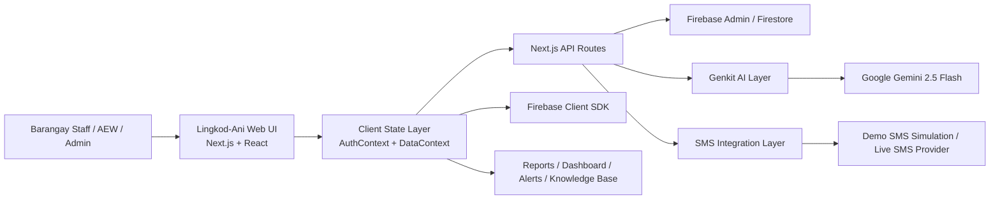
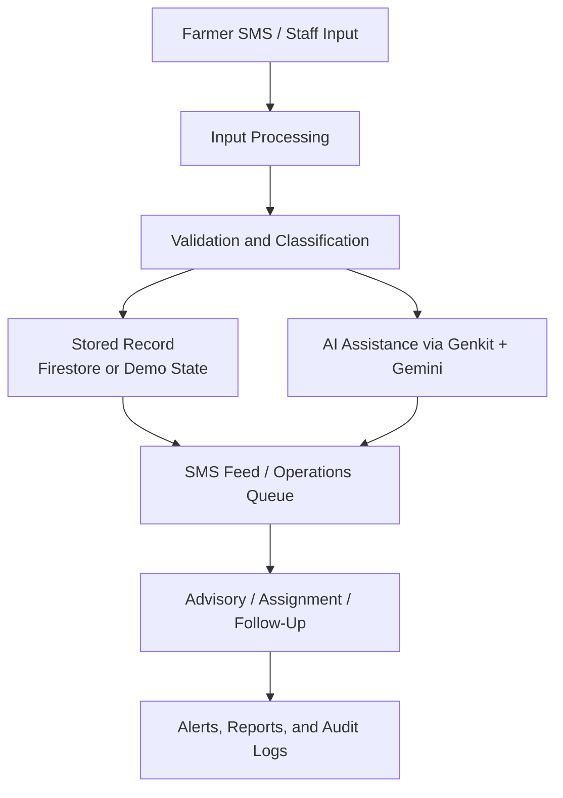

# FINAL COURSE OUTPUT DOCUMENT
## Application Proposal with Integration (Implemented System)

Note: This draft only describes modules and integrations that are already implemented and usable in the current Lingkod-Ani system. Placeholder municipal pages were intentionally excluded from the main scope so the document stays accurate.

---

## Title Page

Project Title: Lingkod-Ani: Barangay Agricultural Advisory System  
Course Subject: [Insert Course Subject]  
Instructor Name: [Insert Instructor Name]  
Group Members: [Insert Group Members]  
Date of Submission: [Insert Date of Submission]  

---

## 1. Application Overview

### Background of the Application
Lingkod-Ani was developed as a barangay-level agricultural advisory and operations system intended to improve how local government staff handle farmer concerns, monitor field issues, and coordinate responses. In many barangays, farmer concerns are still received through informal SMS messages, handwritten notes, chat messages, or disconnected spreadsheets. This leads to delayed responses, missing records, inconsistent follow-ups, and difficulty identifying trends such as pest outbreaks, weather-related damage, or recurring requests for agricultural assistance.

### Purpose of the System
The purpose of Lingkod-Ani is to provide a centralized digital platform where barangay staff can:

- receive and review farmer SMS reports,
- classify and respond to concerns,
- manage farmer records,
- track alerts, inventory, and assistance,
- monitor follow-up tasks, and
- generate operational insights for decision-making.

### Target Users or Intended Audience
The intended users of the system are:

- Barangay agricultural staff
- Agricultural Extension Workers (AEWs)
- Barangay administrators and coordinators
- Authorized developer or technical administrators

The system also indirectly benefits local farmers by enabling faster, better-documented, and more organized responses to their concerns.

### General Description of the System and Its Functionalities
Lingkod-Ani is a web-based application built with a dual-mode setup:

- Demo Application: a safe practice environment using sample barangay data
- Live Application: a real operational mode that connects to live services when credentials are available

The implemented system currently includes the following validated modules:

- guided start flow and login
- barangay dashboard
- farmer registration, approval, and profile management
- SMS feed and operations queue
- alerts and advisory workflow
- knowledge base management
- AI toolkit for agricultural assistance
- inventory and price-watch tools
- reports and charts
- audit log, settings, and data portability controls

---

## 2. Problem and Implemented Solution

### Description of the Problem
The real-world problem addressed by Lingkod-Ani is the lack of a unified barangay system for handling agricultural concerns from farmers. Common issues include:

- SMS reports being received without structured categorization
- delayed or inconsistent replies to urgent farmer concerns
- difficulty tracking whether a case has already been assigned, answered, or closed
- poor visibility into recurring issues like pests, flood risk, or low resource stock
- lack of a centralized farmer database and operational history

Because of these issues, barangay staff may miss urgent cases, duplicate work, or fail to generate timely advisories and follow-up actions.

### Challenges Encountered
During implementation, the project encountered several challenges:

- handling unstructured SMS messages from farmers
- supporting both demo mode and live mode in a single system
- organizing many operational modules under one dashboard
- integrating AI assistance without breaking the core workflow
- designing automation that still works on free-hosting constraints
- keeping the interface understandable for both less-experienced and more advanced users

### Final Implemented Solution
The final implemented solution is a centralized agricultural operations web system where barangay staff can review incoming concerns, manage farmer records, create alerts, track inventory and assistance, and use AI-assisted tools for diagnosis and advisory support.

The system combines:

- a structured dashboard interface,
- role-aware navigation,
- a centralized data layer,
- API-based system actions,
- Firebase-backed live data support, and
- AI-enhanced agricultural tools.

### Explanation of How Integration Improved the System
System integration significantly improved Lingkod-Ani by connecting separate processes into one workflow:

- Firebase integration allows live authentication and real-time data synchronization
- Genkit and Google Gemini add AI-assisted analysis and agricultural guidance
- SMS processing routes allow simulated inbound SMS testing and secure outbound actions
- automation endpoints support overdue case checks and follow-up processing
- shared repositories and context state make records consistent across dashboards, reports, and operational tools

Without integration, the application would only function as separate static pages. With integration, it behaves as one connected operational system.

---

## 3. System Features and Integration

### List of System Features

#### 1. Guided Start Flow and Workspace Recommendation
The system begins with a guided onboarding flow where the user selects Demo or Live mode and receives a recommended workspace based on role, age, and years of service. This helps make the interface more approachable for different barangay users.

#### 2. Authentication and Session Handling
Lingkod-Ani supports:

- demo session handling for practice use, and
- Firebase Authentication for live sign-in

This allows the same system to support both classroom demonstration and real deployment scenarios.

#### 3. Farmer Management
The system includes a farmer registry with:

- farmer approval workflow,
- profile pages,
- status tracking,
- crop information,
- logbook records, and
- assistance history

#### 4. SMS Feed and Case Handling
The SMS feed is one of the main features of the system. It allows staff to:

- review inbound SMS reports,
- see AI-assisted classification metadata,
- assign cases to themselves,
- approve or edit responses,
- close resolved cases, and
- monitor outbound delivery issues

#### 5. Operations and Follow-Up Tracking
The system includes a case-handling workflow for:

- pending work,
- assigned work,
- follow-up tasks, and
- overdue case monitoring

#### 6. Alerts and Advisory Management
Barangay staff can generate alerts, review AI-generated recommendations, and broadcast messages to farmers. The system also stores alert history for later review.

#### 7. Knowledge Base
The application includes a knowledge base where staff can:

- search local articles,
- add new knowledge entries,
- store keywords and summaries, and
- use the collection as a reference when handling farmer concerns

#### 8. AI Toolkit
The AI toolkit provides implemented AI-assisted tools such as:

- plant problem diagnosis from uploaded images,
- fertilizer recommendation calculation,
- pesticide recommendation calculation, and
- profit analysis support

#### 9. Inventory and Price Watch
The system includes operational tools for:

- resource inventory tracking,
- low-stock awareness, and
- price-watch monitoring for agricultural commodities

#### 10. Reports and Analytics
The reporting pages summarize:

- SMS volume,
- common inquiry topics,
- operational counts,
- alerts, and
- other barangay-level activity indicators

#### 11. Audit Log and Settings
The system records actions and supports administrative controls such as:

- automation controls,
- live capability visibility,
- system settings updates, and
- export/import style data portability tools

### External Systems Integrated

The current implemented system integrates with the following external systems or services:

1. Firebase Authentication
2. Firebase Firestore
3. Firebase Storage
4. Firebase Admin SDK
5. Google Gemini through Genkit
6. SMS provider integration layer with demo SMS simulation and live-provider-ready routes

### Explanation of How Each Integration Works in the Actual System

#### Firebase Authentication
Firebase Authentication is used in live mode to sign in authorized users. The client-side authentication flow checks the Firebase session and loads the corresponding user profile.

#### Firebase Firestore
Firestore is used as the live database for operational records such as:

- farmers
- SMS messages
- audit logs
- alerts
- resources
- market prices
- knowledge articles
- vouchers
- field visits
- assistance records

#### Firebase Storage
Firebase Storage is used for file-based content such as uploaded knowledge audio files when the live storage setup is available.

#### Firebase Admin SDK
The Firebase Admin SDK is used on the server side for protected operations such as reading secure data, provisioning live users, and running server-backed actions that should not rely only on the browser.

#### Google Gemini through Genkit
Google Gemini is connected through Genkit and is used for implemented AI flows such as:

- inbound SMS analysis with fallback handling
- alert generation
- plant diagnosis
- fertilizer calculation
- pesticide calculation
- profit analysis

#### SMS Integration Layer
The system includes API routes and service layers for SMS processing. In the current implemented build, demo SMS simulation is fully usable for testing workflows. The live SMS sending and webhook structure is also implemented, with actual live transport becoming fully operational once provider credentials are supplied.

---

## 4. Technology Stack

### Programming Languages

- TypeScript
- JavaScript
- HTML
- CSS

### Frameworks and Libraries

- Next.js 15
- React 19
- Tailwind CSS
- shadcn/ui pattern with Radix UI primitives
- Genkit
- Recharts
- React Hook Form
- Zod
- Lucide React
- Jest

### Database Systems

- Firebase Firestore for live data
- Browser localStorage for demo-mode persistence

### APIs or Third-Party Services

- Google Gemini 2.5 Flash via Genkit
- Firebase Authentication
- Firebase Firestore
- Firebase Storage
- Firebase Admin SDK
- SMS provider abstraction with live-provider-ready endpoint support

### Development Tools

- npm
- Git and GitHub
- Visual Studio Code
- Firebase CLI
- Vercel-ready deployment configuration

---

## 5. System Architecture / Design

### System Architecture Diagram

### Data Flow Diagram

### Explanation of How Components Interact

The system works through the following component interaction:

1. The user opens the Lingkod-Ani web application through the browser.
2. The frontend interface is rendered using Next.js and React.
3. Authentication and role/session state are managed through the application context layer.
4. Operational data is accessed through shared data services and repositories.
5. In live mode, Firestore listeners keep dashboards and records synchronized.
6. When an AI-assisted action is triggered, the request passes through a Genkit flow that communicates with Google Gemini.
7. SMS-related workflows pass through API routes and service logic for inbound analysis, outbound actions, and automation processing.
8. Results are reflected back in dashboards, reports, logs, and case views.

### Highlighted Integration Points

Important integration points in the actual design are:

- browser to Firebase Auth for live login
- browser to Firestore for synchronized records
- Next.js API routes to Firebase Admin for protected actions
- Next.js API routes to Genkit and Gemini for AI-assisted functions
- SMS routes and services for simulation, outbound actions, and automation processing

---

## 6. System Output / Screenshots

Insert actual screenshots from the running Lingkod-Ani system in this section. Recommended screenshot set:

### Figure 1. Start Flow
Screenshot: mode selection page with workspace recommendation  
Description: Shows the user choosing between Demo Application and Live Application and receiving a workspace recommendation based on profile inputs.

### Figure 2. Login Page
Screenshot: login screen  
Description: Shows the authentication entry point of the system for demo or live access.

### Figure 3. Main Dashboard
Screenshot: barangay dashboard  
Description: Displays high-level counts, alerts, charts, and quick access to major modules.

### Figure 4. SMS Feed
Screenshot: SMS Feed page  
Description: Shows farmer messages, AI-assisted analysis, assignment controls, and response actions.

### Figure 5. Farmer Management
Screenshot: farmer registry or farmer profile  
Description: Shows stored farmer records, status, crop data, and operational history.

### Figure 6. Alerts Module
Screenshot: alerts page  
Description: Shows AI-assisted alert generation and alert history.

### Figure 7. Knowledge Base
Screenshot: knowledge base page  
Description: Shows article search, knowledge entries, and barangay reference content.

### Figure 8. AI Toolkit
Screenshot: AI toolkit page  
Description: Shows plant diagnosis, fertilizer, pesticide, and profit tools.

### Figure 9. Inventory and Price Watch
Screenshot: inventory page or price-watch page  
Description: Shows resource monitoring and commodity price tracking.

### Figure 10. Reports or Audit Log
Screenshot: reports page or audit log  
Description: Shows summary analytics and traceable system activity.

---

## 7. Conclusion

### Key Achievements
The Lingkod-Ani project successfully delivered a working integrated web system for barangay agricultural operations. The project achieved:

- a unified dashboard for agricultural operations
- structured farmer and SMS case management
- AI-assisted advisory support
- live-ready Firebase data integration
- operational modules for alerts, inventory, price watch, and reporting
- dual demo and live application modes for both presentation and deployment use

### System Impact or Benefits
The system improves barangay operations by:

- reducing disorganized handling of farmer concerns
- improving visibility over SMS reports and follow-ups
- giving staff a central place for records and advisories
- making reports and patterns easier to understand
- supporting faster coordination for agricultural concerns

### Limitations Encountered
The current implementation still has some limitations:

- some municipal pages are present in routing but not part of the completed validated scope
- the knowledge base currently relies on local article matching in the active build
- inbound SMS analysis includes a safe fallback path when AI responses fail
- full live SMS deployment still depends on provider credentials in the production environment
- automated test coverage is still limited compared with the size of the system

### Recommendations or Future Improvements
For future improvement, the project may be extended through:

- full production rollout of live SMS transport and status callbacks
- deeper AI integration for knowledge base search and case summaries
- stronger automated testing and lint enforcement
- server-side route protection hardening for live deployments
- completion of currently out-of-scope municipal pages
- richer reporting and export features for LGU decision support

---

## Formatting Notes for Final Submission

When transferring this draft into the final submission document:

- use Times New Roman, font size 12
- apply 2.0 line spacing
- set 1-inch margins on all sides
- insert actual screenshots from the running system
- replace all title page placeholders with final class information
