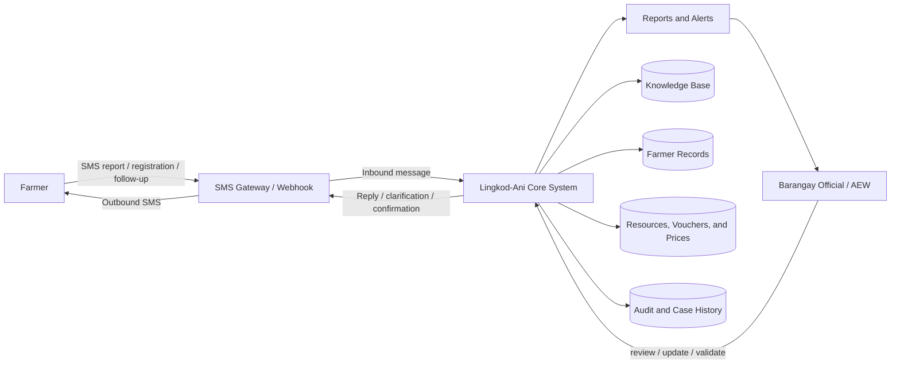
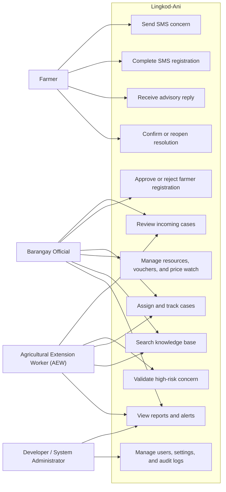
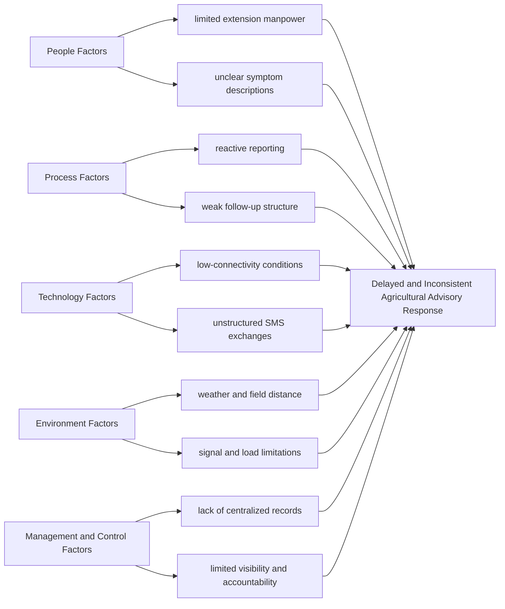
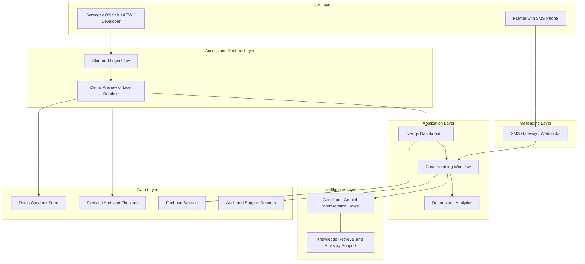
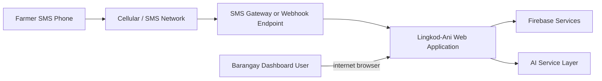
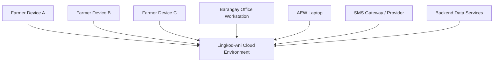
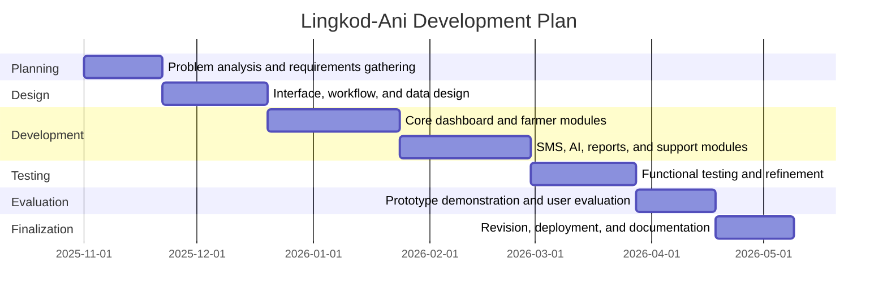
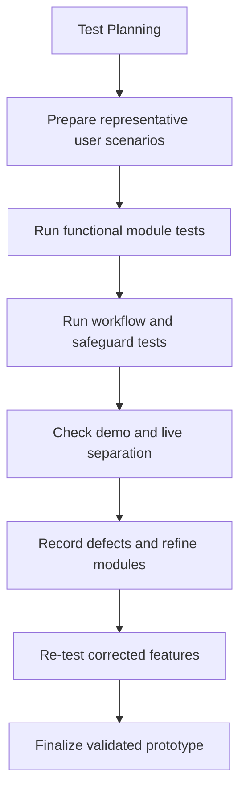

# Lingkod-Ani Thesis Alignment Guide

This guide compares the current Lingkod-Ani manuscript with the section coverage shown in `Interactive (1).pdf` and converts the gaps into thesis-ready, app-aligned content.

## 1. Direct Gap Verdict

### What your current Lingkod-Ani manuscript already does better than Interactive

- Stronger problem-to-solution alignment
- Stronger Statement of the Problem traceability
- Stronger mixed-method design
- Stronger Results and Discussion chapter
- Stronger human-in-the-loop safety framing
- Stronger prototype evaluation logic

### What Interactive includes that your current Lingkod-Ani manuscript still lacks

- formal interface design plates for core modules
- a dedicated forms subsection
- a dedicated reports subsection
- data dictionary
- requirement specification
- technical feasibility
- operational feasibility
- economic feasibility
- requirements modeling
- explicit Input-Process-Output-Performance-Control discussion
- modeling diagrams beyond the conceptual IPO
- use case diagram
- fishbone diagram
- system architecture diagram
- network model
- network topology
- development plan
- software specification
- hardware specification
- security section as a technical documentation block
- program specification
- programming environment
- test plan
- testing subsection
- system testing subsection
- a clean conclusion chapter
- a clean recommendations chapter
- a finalized references section that clearly matches every in-text citation

## 2. Best Structural Fix

Do not copy Interactive's exact placement.

Interactive places many technical documentation sections inside the same chapter as Results and Discussion. Your manuscript is already stronger analytically than theirs, so the cleaner structure is:

1. Chapter 1: Introduction
2. Chapter 2: Technical Background and Methodology
3. Chapter 3: Results and Discussion
4. Chapter 4: System Design, Implementation, and Technical Documentation
5. Chapter 5: Conclusion and Recommendations
6. References
7. Appendices

This structure is better than Interactive because it keeps your research findings separate from your system documentation. That makes your defense cleaner and more academically organized.

## 3. Critical Alignment Notes You Should Apply in the Manuscript

- Keep describing Lingkod-Ani as a `prototype-level, live-capable` system, not a fully institutionalized production system.
- Keep stating that `serious, unclear, or high-risk concerns require human review`.
- In the paper, use `Print / Save as PDF` instead of claiming that the system generates a fully downloadable PDF file.
- State clearly that the system has `separate demo and live modes`.
- State that demo mode uses `sandboxed simulated data that resets after logout`.
- State that live mode uses `Firebase-backed authenticated records`.
- If you mention live profile image upload, add a deployment note that it depends on `Firebase Storage configuration and rules`.
- If you mention real SMS deployment, add a deployment note that it depends on `gateway credentials, webhook setup, and device/provider readiness`.

## 4. Ready-to-Paste Chapter 4 Opening

### System Design, Implementation, and Technical Documentation

This chapter presents the system design, implementation structure, and technical documentation of Lingkod-Ani. While the previous chapter focused on the study findings and prototype evaluation, the present chapter describes how the system was organized as an AI-assisted, SMS-based agricultural advisory and management platform for Barangay Batakil. It documents the major modules, forms, reports, data structures, architectural components, feasibility considerations, specifications, security controls, and testing approach used in the development of the system.

Lingkod-Ani was designed to support two operational contexts: a sandboxed demo mode for presentation, simulation, and safe walkthroughs, and a live-capable mode for authenticated, Firebase-backed operation. This separation is important because the system must be demonstrable to evaluators and stakeholders without affecting live records, while still maintaining a deployment path for real-world use. Across both modes, the core system design remains centered on SMS-first reporting, AI-assisted interpretation, human-in-the-loop review, dashboard-based case handling, follow-up continuity, and role-aware barangay operations.

## 5. Design Section

### Design Overview

The design of Lingkod-Ani follows a task-centered information system approach in which each major interface supports an operational step in the barangay agricultural advisory workflow. The system begins with user access and mode selection, proceeds to concern intake and review, and then extends into farmer registration, approval, knowledge support, resource coordination, reporting, and administrative management. Rather than treating the interface as a set of isolated screens, the design was organized around continuity of work: receiving a concern, understanding it, validating it when necessary, acting on it, documenting the action taken, and monitoring the case until closure or follow-up completion.

### What to Screenshot and Use as Figure Captions

Use real screenshots from the current app. If a screenshot is taken in demo mode, keep the interface truthful and avoid presenting demo data as live field data.

- `Figure 12. Start Page and Mode Selection of Lingkod-Ani`
  - Screenshot route: `/start`
  - Show: Demo Application, Live Application, and workspace recommendation flow
  - Caption: This figure shows the startup page of Lingkod-Ani where users choose between the demo application and the live application and complete the initial profile and workspace-selection flow.

- `Figure 13. Login Module of Lingkod-Ani`
  - Screenshot route: `/login`
  - Show: email, password, and access request or sign-in area
  - Caption: This figure presents the login module of Lingkod-Ani used by authorized users to access the live-capable dashboard environment.

- `Figure 14. Operations Dashboard Module`
  - Screenshot route: `/dashboard/operations`
  - Show: summary cards, alerts, queues, and activity overview
  - Caption: This figure presents the main dashboard module of Lingkod-Ani, which provides users with an overview of agricultural concerns, alerts, pending actions, and operational priorities.

- `Figure 15. SMS Feed and Case Review Module`
  - Screenshot route: `/dashboard/sms-feed`
  - Show: message cards, AI interpretation, urgency, safety flag, and action buttons
  - Caption: This figure shows the SMS feed module where incoming farmer messages are reviewed together with AI-assisted interpretation, urgency classification, and case-handling actions.

- `Figure 16. Farmer Registration Form`
  - Screenshot route: `/dashboard/farmers/register`
  - Show: full form with name, phone, barangay, sitio, crops, and demographics
  - Caption: This figure presents the farmer registration form used to manually encode and submit a new farmer profile for approval.

- `Figure 17. Pending Farmer Approval Module`
  - Screenshot route: `/dashboard/farmers/approvals`
  - Show: pending list and approve/reject actions
  - Caption: This figure shows the farmer approval module where pending farmer registrations are reviewed before inclusion in the active farmer database.

- `Figure 18. Farmer Database Module`
  - Screenshot route: `/dashboard/farmers`
  - Show: active roster, search bar, edit/archive/delete actions
  - Caption: This figure presents the farmer database module used to view, update, search, and manage approved farmer records.

- `Figure 19. Resource Inventory Module`
  - Screenshot route: `/dashboard/inventory`
  - Show: resource list plus add/edit dialog
  - Caption: This figure shows the resource inventory module used to manage barangay agricultural resources, stock levels, and category-based resource records.

- `Figure 20. Voucher Management Module`
  - Screenshot route: `/dashboard/vouchers`
  - Show: voucher table, issuance button, redeem controls
  - Caption: This figure presents the voucher management module used to issue, monitor, and redeem agricultural support vouchers.

- `Figure 21. Price Watch Module`
  - Screenshot route: `/dashboard/price-watch`
  - Show: price board and top edit form
  - Caption: This figure shows the price watch module used to record and update local market price references for common crops.

- `Figure 22. Knowledge Base Module`
  - Screenshot route: `/dashboard/knowledge-base`
  - Show: search interface, article cards, or AI-supported retrieval area
  - Caption: This figure presents the knowledge base module where users can access stored agricultural guidance and search contextual information for advisory support.

- `Figure 23. Reports and Analytics Dashboard`
  - Screenshot route: `/dashboard/reports`
  - Show: summary cards, chart panels, and print/save button
  - Caption: This figure shows the reports and analytics dashboard used to visualize recurring concerns, case trends, communication activity, and operational indicators.

- `Figure 24. Account and Profile Settings Module`
  - Screenshot route: `/dashboard/account`
  - Show: avatar upload, profile fields, workspace preference, security settings
  - Caption: This figure presents the account and profile settings module where users manage identity information, workspace preference, and account-related security settings.

### Forms Subsection

The forms in Lingkod-Ani were designed to reduce encoding friction while preserving the minimum information needed for reliable case handling and farmer record management. Consistent with the needs of barangay operations, forms were kept task-oriented rather than overly technical. Core form workflows include profile editing, farmer registration, farmer approval review, resource encoding, voucher issuance, price watch updates, and selected settings and security tasks. In design terms, the forms prioritize validation, readable labels, and direct action paths so that administrative users can complete operational tasks without navigating away from the main workflow context.

### Reports Subsection

The reporting layer of Lingkod-Ani was designed to transform individual SMS cases and operational records into usable barangay-level insights. Rather than providing only raw tables, the reports module aggregates communication volume, concern categories, workflow outcomes, follow-up indicators, and selected operational patterns into visual summaries. This design supports both day-to-day monitoring and longer-horizon reflection on recurring agricultural issues, coordination needs, and extension workload. For thesis documentation, the reports section should emphasize that the module is not decorative analytics but a decision-support layer tied to actual advisory operations.

## 6. Core Data Dictionary

### Data Dictionary Introductory Paragraph

The data structures of Lingkod-Ani were designed to support end-to-end case intake, review, coordination, and reporting. The system stores user accounts, farmer records, SMS messages, resource records, voucher transactions, price watch entries, knowledge resources, alerts, field support records, and audit trails. These entities work together to preserve continuity between concern reporting, administrative handling, follow-up actions, and reporting outputs.

### Core Data Dictionary Table

| Entity | Purpose | Primary Key | Important Fields |
|---|---|---|---|
| `User` | Stores authenticated dashboard users and their roles | `id` | `email`, `name`, `role`, `phone`, `barangay`, `avatarUrl`, `permissions`, `status`, `preferredWorkspace` |
| `Farmer` | Stores farmer demographic and farm profile information | `id` | `name`, `phone`, `barangay`, `sitio`, `farmSize`, `crops`, `status`, `householdId`, `profileHistory` |
| `SmsMessage` | Stores inbound farmer SMS and its analysis | `id` | `farmerId`, `message`, `timestamp`, `parsedIntent`, `urgency`, `safetyFlag`, `caseStatus`, `assignedToUserId`, `aiAdvice` |
| `OutboundMessage` | Stores replies, reminders, and outbound notices | `id` | `smsMessageId`, `recipientPhone`, `purpose`, `body`, `status`, `provider`, `sentAt` |
| `Resource` | Stores barangay agricultural resources and stock | `id` | `name`, `category`, `inventoryGroup`, `subcategory`, `intendedUse`, `stock`, `unit`, `lastUpdated` |
| `Voucher` | Stores voucher issuance and redemption records | `id` | `farmerId`, `resourceId`, `quantity`, `code`, `status`, `issueDate`, `redemptionDate` |
| `MarketPriceEntry` | Stores local crop price references | `id` | `crop`, `price`, `unit`, `source`, `trend`, `updatedAt` |
| `KnowledgeArticle` | Stores agricultural articles and knowledge resources | `id` | `title`, `summary`, `content`, `keywords`, `type`, `reviewStatus`, `author`, `lastUpdated` |
| `AlertHistoryEntry` | Stores historical alerts and broadcasted warnings | `id` | `title`, `type`, `severity`, `message`, `recommendation`, `source`, `recipientFarmerIds`, `timestamp` |
| `FarmerAssistanceRecord` | Stores assistance, referrals, and aid linked to farmers | `id` | `farmerId`, `relatedSmsId`, `type`, `title`, `details`, `status`, `providedBy`, `createdAt` |
| `FieldVisitTask` | Stores scheduled and completed field visits | `id` | `farmerId`, `title`, `purpose`, `scheduledFor`, `assignedTo`, `priority`, `status`, `verificationStatus` |
| `AuditLog` | Stores sensitive actions and operational trace records | `id` | `timestamp`, `user`, `action`, `details`, `category`, `severity`, `beforeSnapshot`, `afterSnapshot` |

If you want a full thesis-style dictionary, expand each of the above into separate tables with field name, data type, description, example value, and whether the field is required.

## 7. Requirement Specification

### Requirement Specification Introductory Paragraph

The requirements of Lingkod-Ani were derived from the communication and coordination problems identified in Barangay Batakil and translated into operational system functions and quality expectations. The system was not intended merely to send messages, but to structure agricultural concern intake, support advisory interpretation, preserve human oversight, and maintain continuity between reporting, action, and follow-up.

### Functional Requirements

| Code | Functional Requirement |
|---|---|
| `FR-01` | The system shall allow farmers to send agricultural concerns through SMS using basic mobile phones. |
| `FR-02` | The system shall interpret incoming SMS messages and classify them according to intent, urgency, and safety level. |
| `FR-03` | The system shall support farmer registration, including partial or incomplete registration continuation through follow-up interactions. |
| `FR-04` | The system shall allow authorized users to approve, reject, archive, edit, and manage farmer records. |
| `FR-05` | The system shall route unclear or high-risk concerns for human review and validation. |
| `FR-06` | The system shall support dashboard-based review, assignment, follow-up, and case-outcome tracking. |
| `FR-07` | The system shall provide access to a local knowledge base and AI-assisted knowledge retrieval features. |
| `FR-08` | The system shall manage agricultural resources, vouchers, and price watch entries. |
| `FR-09` | The system shall generate operational reports and chart-based analytics from stored records. |
| `FR-10` | The system shall maintain audit logs, alerts, and historical support records for traceability and accountability. |
| `FR-11` | The system shall support a demo mode using sandboxed mock data and a live-capable mode using authenticated backend services. |
| `FR-12` | The system shall reset demo data after logout to prevent cross-user contamination of simulated records. |

### Non-Functional Requirements

| Code | Non-Functional Requirement |
|---|---|
| `NFR-01` | The system shall remain usable in low-connectivity environments by supporting SMS-first reporting. |
| `NFR-02` | The system shall provide understandable interfaces for both farmers and barangay administrative users. |
| `NFR-03` | The system shall preserve role-based access control for authenticated users. |
| `NFR-04` | The system shall preserve separation between demo data and live data. |
| `NFR-05` | The system shall maintain auditability for sensitive operational actions. |
| `NFR-06` | The system shall respond to representative input cases without excessive internal processing delay. |
| `NFR-07` | The system shall be maintainable through modular components, typed models, and repository-based data access. |
| `NFR-08` | The system shall remain deployable through cloud-hosted web infrastructure and managed backend services. |

## 8. Feasibility Study

### Technical Feasibility

Lingkod-Ani is technically feasible because its core architecture is built on widely available and well-supported technologies that are appropriate for web deployment and SMS-assisted workflows. The current prototype already operates through a Next.js and TypeScript web application, Firebase-backed data services for live-capable operation, and Genkit-powered AI orchestration for language interpretation and advisory support. Because the system is SMS-first on the farmer side and browser-based on the administrative side, it does not require all users to adopt smartphones or dedicated client applications in order to participate in the workflow.

### Operational Feasibility

Lingkod-Ani is operationally feasible within the barangay context because it aligns with the actual communication behavior of the intended users. Farmers may continue using basic mobile phones, while barangay officials and the Agricultural Extension Worker (AEW) interact through a browser-based administrative dashboard. The operational workflow also fits the real structure of barangay agricultural support by allowing concerns to be received centrally, reviewed by responsible personnel, escalated when necessary, and followed through using reminders, logs, and dashboard visibility.

### Economic Feasibility

Lingkod-Ani is economically feasible at the prototype and early deployment level because it does not require expensive on-premise server infrastructure or specialized end-user hardware. Farmers only need access to SMS-capable phones, while administrative users need standard internet-connected computers or laptops. On the system side, hosting and backend services may be provisioned through managed platforms such as Vercel and Firebase, allowing the project to start small and scale gradually according to barangay readiness, available budget, and operational need.

## 9. Requirements Modeling

### Input-Process-Output-Performance-Control Paragraph

The requirements model of Lingkod-Ani may be expressed through Input, Process, Output, Performance, and Control dimensions. Inputs include farmer SMS reports, registration details, support requests, administrative updates, and reference data such as knowledge articles, resources, and price records. Processes include intake, interpretation, clarification, escalation, dashboard review, follow-up, and reporting. Outputs include advisory responses, alerts, case updates, reports, and monitored operational records. Performance refers to the timeliness and consistency of internal workflow behavior under representative prototype conditions. Control refers to the mechanisms that preserve accountability, safety, permissions, follow-up rules, and auditability across the workflow.

### Input-Process-Output-Performance-Control Summary

| Dimension | Lingkod-Ani Application |
|---|---|
| `Input` | SMS reports, farmer registration data, resource data, price updates, knowledge articles, administrative actions |
| `Process` | interpretation, classification, clarification, escalation, review, assignment, follow-up, tracking, reporting |
| `Output` | advice, reminders, alerts, reports, case status changes, audit records, voucher and resource transactions |
| `Performance` | workflow conformance, safeguard conformance, low internal processing overhead, continuity of case handling |
| `Control` | user authentication, role-based access, human validation, audit logs, demo/live separation, follow-up rules |

### DFD Level 0

## 10. Modeling

### Use Case Diagram

### Fishbone Diagram

## 11. System Architecture

### Architecture Paragraph

Lingkod-Ani follows a web-based, SMS-assisted, cloud-supported architecture. Farmers interact through SMS-capable phones, while barangay users and the AEW interact through a browser-based dashboard. The application layer handles interface rendering, workflow control, and repository-based data access. AI-assisted interpretation is handled through orchestrated language-processing flows, while persistent records are stored in backend services. The architecture also preserves separation between demo preview operation and live authenticated operation, allowing safe simulation without contaminating real records.

### System Architecture Diagram

## 12. Network Model

### Network Model Paragraph

The logical network model of Lingkod-Ani connects farmers, dashboard users, web hosting, backend services, and SMS transport. Farmers interact through the GSM network using standard SMS, while administrative users access the web dashboard over the internet. The application itself is hosted as a web service and communicates with backend data services and message-processing endpoints. This model supports centralized case handling without requiring local server infrastructure in the barangay office.

### Network Model Diagram

## 13. Network Topology

### Network Topology Paragraph

From a deployment perspective, Lingkod-Ani follows a cloud-centered star topology. The hosted application and backend services serve as the central nodes, while farmer devices, dashboard users, and gateway integrations act as connecting endpoints. This topology is appropriate for the project because it reduces the need for onsite infrastructure and supports centralized monitoring, updating, and data management.

### Network Topology Diagram

## 14. Development Plan

### Development Plan Paragraph

The development of Lingkod-Ani followed an iterative plan consistent with Agile principles. The work began with problem analysis and requirements gathering, followed by design modeling, module development, integration of AI-assisted and SMS-related workflows, prototype testing, user-oriented evaluation, and refinement. This structure allowed the researchers to adjust modules based on testing results and evaluation feedback rather than freezing the system too early.

### Development Plan Diagram

If these dates do not match your actual project log, keep the phases and replace the dates with your real timeline.

## 15. Software Specification

### Software Specification Paragraph

Lingkod-Ani was developed as a web-based information system using a modern TypeScript and React ecosystem. The application layer was built using Next.js with the App Router, while interface styling and interaction relied on Tailwind CSS and Radix UI-based components. Data validation used React Hook Form and Zod. Chart-based reports used Recharts. For live-capable backend services, the system used Firebase technologies for authentication and data storage. AI-assisted interpretation and knowledge-support workflows were orchestrated through Genkit with Google Gemini models.

### Software Specification Table

| Software Component | Purpose |
|---|---|
| `Next.js 15.5.9` | web framework and routing |
| `React 19` | component-based interface rendering |
| `TypeScript 5` | static typing and maintainability |
| `Tailwind CSS` | utility-based styling |
| `Radix UI / ShadCN UI` | accessible interface components |
| `React Hook Form` | form state handling |
| `Zod` | validation schema support |
| `Recharts` | report and analytics charts |
| `Firebase` | authentication and live-capable data services |
| `Firebase Admin` | server-side administrative integration |
| `Genkit` | AI workflow orchestration |
| `Google Gemini` | AI-assisted language and advisory processing |
| `Jest` | test execution |
| `ESLint` | code quality checking |

## 16. Hardware Specification

### Hardware Specification Paragraph

Lingkod-Ani does not require specialized or high-cost end-user hardware. On the farmer side, the minimum requirement is an SMS-capable mobile phone. On the administrative side, the system may be operated through standard desktop computers or laptops with internet access and a modern browser. Because the system is cloud-hosted and live-capable rather than dependent on local server installation, hardware demands at the barangay level remain modest. For real SMS deployment, a compatible SMS gateway provider or device setup is additionally required.

### Hardware Specification Table

| Hardware Item | Suggested Requirement | Purpose |
|---|---|---|
| Farmer phone | SMS-capable basic phone or smartphone | send concerns and receive replies |
| Barangay workstation | dual-core processor or better, 8 GB RAM, browser access | dashboard operation |
| AEW laptop | dual-core processor or better, 8 GB RAM, browser access | validation and field coordination |
| Internet connection | stable connection for dashboard users | live-capable access and syncing |
| SMS gateway setup | provider account or compatible gateway device | real inbound and outbound SMS handling |

## 17. Security

### Security Paragraph

The security design of Lingkod-Ani combines authentication, role-aware access control, auditability, and safety-oriented workflow restrictions. Live-capable access is limited to authenticated users, and sensitive actions are associated with specific roles, permissions, and operational records. The system also preserves separation between demo preview data and live records to avoid cross-environment contamination during presentation and testing. On the advisory side, safety is further strengthened by a human-in-the-loop mechanism in which serious, unclear, or higher-risk concerns are escalated for review instead of being treated as fully resolved by automation alone. These controls support both data privacy and operational accountability in line with the requirements of barangay-level public service systems.

## 18. Program Specification

### Program Specification Paragraph

Programmatically, Lingkod-Ani accepts farmer-generated SMS input and administrative form input, processes them through rule-based and AI-assisted workflows, stores the resulting records in structured data entities, and produces operational outputs such as replies, alerts, reports, and tracked case-state changes. The program logic includes runtime mode selection, farmer record handling, message interpretation, case routing, role-sensitive user actions, resource and voucher state updates, price watch management, reporting computations, and audit-support behavior. This allows the system to function not merely as a message viewer but as a coordinated barangay agricultural operations platform.

## 19. Programming Environment

### Programming Environment Paragraph

The development environment of Lingkod-Ani consisted of a Node.js-based web development stack with local development, type checking, linting, and test tooling. The system was developed using a TypeScript-compatible editor environment, package management through npm, and cloud deployment through Vercel for the web application. Backend configuration and live-capable service integration were supported through Firebase configuration tools. This environment enabled iterative prototyping, validation, and deployment while keeping the system maintainable for future enhancement.

## 20. Test Plan

### Test Plan Paragraph

The test plan of Lingkod-Ani was designed to examine both workflow correctness and practical usability. Testing focused on message intake, farmer registration behavior, approval and deletion actions, inventory and voucher state changes, price watch updates, report generation behavior, demo/live separation, and overall consistency of case handling across representative scenarios. The plan also considered system safety by examining the handling of unclear or higher-risk cases, follow-up behavior, and the persistence of critical state changes.

### Test Plan Diagram

## 21. Testing

### Testing Paragraph

Testing of Lingkod-Ani combined controlled prototype checks, interface-level action testing, and scenario-based validation. The system was examined not only for whether individual buttons worked, but also for whether actions remained consistent across the wider workflow. For example, the testing scope considered whether a registered farmer appears in the approval queue, whether an approved farmer appears in the farmer database, whether simulated inbound SMS messages appear in reports and case views, whether edits persist across related records, and whether demo data resets correctly after logout.

## 22. System Testing

### System Testing Paragraph

System testing verified the integrated behavior of Lingkod-Ani across its major modules. Demo-side testing confirmed the operability of simulated SMS intake, farmer registration, farmer approval, farmer deletion, profile image upload in sandbox mode, inventory editing, voucher redemption, price watch editing, reports print or save behavior, and demo data reset after logout. Live-capable testing confirmed production deployment, route accessibility, and updated Firestore rules, while also identifying infrastructure-dependent items such as Firebase Storage initialization and real SMS gateway readiness as external deployment prerequisites rather than core interface defects. This distinction is important because it shows that the application logic and interface workflows may be correct even when specific live services still require configuration.

## 23. Ready-to-Use Better-Than-Interactive Conclusion

### Conclusion

The study concluded that Lingkod-Ani is a relevant and technically coherent response to the communication and coordination challenges faced in barangay-level agricultural advisory work. By combining SMS-based concern reporting, AI-assisted interpretation, human-in-the-loop validation, dashboard-based case review, and follow-up continuity, the system addresses the documented weaknesses of delayed consultation, unclear reporting, and weak monitoring of farmer concerns. The prototype-level findings further showed that Lingkod-Ani was strongly acceptable in terms of functionality, perceived ease of use, perceived usefulness, and trust, safety, and management support.

Beyond acceptability, the system also demonstrated that an SMS-first agricultural platform can support more structured barangay operations without requiring all users to depend on smartphones or high-bandwidth digital tools. In this sense, Lingkod-Ani is not merely a messaging tool but a coordination and decision-support information system that helps connect farmer concerns to review, action, documentation, and follow-up. Its strongest contribution lies in turning fragmented agricultural concern reporting into a more organized, visible, and accountable advisory workflow.

## 24. Ready-to-Use Better-Than-Interactive Recommendations

### Recommendations

Based on the findings of the study, future work on Lingkod-Ani should prioritize longer field deployment, broader testing under real operational conditions, and continued refinement of live infrastructure dependencies such as SMS gateway readiness and cloud service configuration. The knowledge base may be expanded further to support more localized agricultural cases, while reporting may be enhanced through more formal export options and deeper trend analysis for planning and intervention support.

It is also recommended that future implementation preserve the system’s human-in-the-loop design, particularly for serious, unclear, or high-risk concerns, to avoid overreliance on automation in livelihood-sensitive situations. Additional enhancements may include wider barangay rollout, stronger audit-review workflows, richer evidence attachment support, and extended evaluation involving a larger respondent base and longer observation period. These directions would help transition Lingkod-Ani from a strong prototype-level system into a more mature operational platform.

## 25. What You Should Still Change in the Current Lingkod-Ani Document

- Add a full `Chapter 4: System Design, Implementation, and Technical Documentation`.
- Move all technical documentation sections out of Results and Discussion instead of copying Interactive's structure.
- Add a full `Chapter 5: Conclusion and Recommendations`.
- Add a finalized references section that matches all in-text citations.
- Continue figure numbering after your existing Results and Discussion figures.
- Use actual Lingkod-Ani screenshots, not mock wireframes.
- Make screenshot captions operational, not decorative.
- Keep language consistent with the app: SMS-first, AI-assisted, human-validated, dashboard-supported.
- Do not overclaim full production readiness in places where infrastructure still depends on configuration.

## 26. Best Final Positioning

To surpass Interactive, your paper should not simply have more sections. It should have better alignment. Interactive has more documentation blocks, but many of them are generic. Lingkod-Ani can be stronger by making every added section directly traceable to the actual problem, the actual modules in the app, the actual data entities in the code, and the actual workflow observed in testing and evaluation.

That is the standard that will make your thesis more defensible than Interactive.
