# CHAPTER 4
# SYSTEM DESIGN, IMPLEMENTATION, AND TECHNICAL DOCUMENTATION

## Chapter Overview

This chapter presents the system design, implementation structure, and technical documentation of Lingkod-Ani. While the preceding chapter established the research findings, prototype behavior, and user acceptability of the system, the present chapter explains how the proposed platform was structured as an SMS-first, AI-assisted, human-validated, and dashboard-supported agricultural advisory and management information system. It documents the interface design, operational modules, forms, reports, data structures, requirement specifications, feasibility considerations, modeling outputs, system architecture, network structure, development plan, software and hardware requirements, security controls, and testing approach of the project.

Unlike generic capstone documentation that merely lists technical sections for compliance, this chapter directly traces each documentation block to the actual problem addressed by the study, the actual modules implemented in the application, the actual data entities defined in the codebase, and the actual workflow observed in prototype testing and evaluation. In this way, the chapter strengthens the defensibility of Lingkod-Ani as both a research-based and system-based capstone project.

Lingkod-Ani was developed to support two operational contexts: a sandboxed demo mode for presentation, simulation, and safe walkthroughs, and a live-capable mode for authenticated, Firebase-backed use. This distinction is important in both technical and methodological terms. The demo mode allows evaluators, researchers, and stakeholders to explore the complete workflow without altering live records, while the live-capable mode preserves the deployment path for real-world agricultural operations. Across both contexts, however, the core logic remains the same: farmers report through SMS, the system interprets and classifies concerns, uncertain or high-risk cases are escalated for review, and barangay users manage case flow through the dashboard.

## System Design

### Design Philosophy

The design of Lingkod-Ani follows a task-centered information system approach rather than a feature-isolated interface approach. This means that the screens and modules were organized not simply around menu categories, but around the operational sequence of barangay agricultural support. The system begins with access and mode selection, continues to concern intake and case interpretation, expands into farmer record management and approval, supports resource coordination and price referencing, and finally provides monitoring, reporting, and follow-up visibility. Each part of the design was intended to reduce communication friction, preserve continuity of work, and maintain human oversight where it matters most.

The design also reflects the realities of Barangay Batakil. Since farmers may only have access to basic mobile phones and intermittent signal, the farmer-facing side of Lingkod-Ani was kept SMS-first rather than app-first. On the administrative side, the dashboard was designed to help barangay officials and the Agricultural Extension Worker (AEW) move from scattered or reactive concern handling toward a more organized advisory workflow. This led to an interface that privileges readability, direct actions, visible case state, contextual follow-up cues, and clearer record management rather than purely aesthetic complexity.

### Module Design

The system is composed of interconnected modules that correspond to the operational requirements of barangay agricultural advisory work. The major modules include the start and login flow, dashboard overview, SMS feed and case review, farmer registration and approval, farmer database management, inventory and voucher management, price watch, knowledge base, reports and analytics, account and security settings, and administrative monitoring tools. These modules are not isolated functions; rather, they share data structures and workflow states so that changes made in one module are reflected in related views, reports, and records.

### Design Figures and Screenshot Guide

Use real screenshots from the current Lingkod-Ani application. Do not use mock wireframes. If a figure is captured in demo mode, keep the figure truthful by showing the demo banner when visible and by avoiding any claim that the displayed records are live operational data.

#### Figure 12. Start Page and Mode Selection of Lingkod-Ani

What to screenshot:
- Route: `/start`
- Show the startup page with the `Demo Application` and `Live Application` choices.
- Include the role, age, years in service, and workspace recommendation portion if possible.

Caption:
This figure presents the startup page of Lingkod-Ani where users select either the demo application or the live application and complete the initial profile and workspace recommendation flow before entering the dashboard.

#### Figure 13. Login Module of Lingkod-Ani

What to screenshot:
- Route: `/login`
- Show the email and password fields, live login framing, and access-related prompts.

Caption:
This figure shows the login module of Lingkod-Ani used by authenticated users to access the live-capable dashboard environment.

#### Figure 14. Homepage or Operations Dashboard Module

What to screenshot:
- Route: `/dashboard/operations`
- Show the main summary cards, alerts, and operational overview panels.

Caption:
This figure presents the main dashboard module of Lingkod-Ani, which provides a centralized overview of priority concerns, alerts, case activity, and operational status for barangay agricultural personnel.

#### Figure 15. SMS Feed and Case Review Module

What to screenshot:
- Route: `/dashboard/sms-feed`
- Show incoming message cards, AI-assisted analysis, urgency, safety flag, and available action controls.
- If using demo mode, include the simulation panel.

Caption:
This figure shows the SMS feed module where incoming farmer messages are reviewed together with AI-assisted interpretation, urgency classification, and case-handling actions.

#### Figure 16. Farmer Registration Form

What to screenshot:
- Route: `/dashboard/farmers/register`
- Show the full form fields, including name, phone, barangay, sitio, crops, and relevant demographic fields.

Caption:
This figure presents the farmer registration form used to manually encode and submit a new farmer profile for approval in the system.

#### Figure 17. Pending Farmer Approval Module

What to screenshot:
- Route: `/dashboard/farmers/approvals`
- Show the pending list and the approve or reject action controls.

Caption:
This figure shows the farmer approval module where pending registrations are reviewed before they are added to the active farmer database.

#### Figure 18. Farmer Database Module

What to screenshot:
- Route: `/dashboard/farmers`
- Show the search bar, active farmer records, and the edit, archive, or delete action controls.

Caption:
This figure presents the farmer database module used to search, review, update, archive, and remove approved farmer records.

#### Figure 19. Resource Inventory Module

What to screenshot:
- Route: `/dashboard/inventory`
- Show the inventory table and either the add-resource or edit-resource dialog.

Caption:
This figure shows the resource inventory module used to manage agricultural resource records, stock levels, and category-based resource information in Lingkod-Ani.

#### Figure 20. Voucher Management Module

What to screenshot:
- Route: `/dashboard/vouchers`
- Show voucher issuance, voucher code records, and redemption controls.

Caption:
This figure presents the voucher management module used to issue, monitor, and redeem agricultural support vouchers linked to farmers and resources.

#### Figure 21. Price Watch Module

What to screenshot:
- Route: `/dashboard/price-watch`
- Show the top form and the price table below it.

Caption:
This figure shows the price watch module used to record, update, and monitor local crop price references for barangay agricultural support.

#### Figure 22. Knowledge Base Module

What to screenshot:
- Route: `/dashboard/knowledge-base`
- Show the article list, search controls, or AI-assisted retrieval context if visible.

Caption:
This figure presents the knowledge base module where users can access stored agricultural guidance and search for contextual information to support advisory decision-making.

#### Figure 23. Reports and Analytics Dashboard

What to screenshot:
- Route: `/dashboard/reports`
- Show summary cards and several chart panels.
- Include the `Print / Save as PDF` button if visible.

Caption:
This figure presents the reports and analytics dashboard used to visualize communication activity, advisory patterns, recurring concerns, and other operational indicators derived from the system records.

#### Figure 24. Account and Profile Settings Module

What to screenshot:
- Route: `/dashboard/account`
- Show profile fields, avatar area, and workspace or security sections.

Caption:
This figure presents the account and profile settings module where users manage identity information, workspace preference, profile image, and account-related settings.

### Forms

The forms in Lingkod-Ani were designed to reduce encoding friction while preserving the minimum information needed for reliable case handling, farmer identification, and administrative accountability. Core form workflows include farmer registration, profile updating, resource creation and editing, voucher issuance, price entry creation and editing, and selected administrative settings. The forms use readable labels, constrained input controls, and validation logic so that operational users can complete tasks with minimal ambiguity. In terms of system design, the forms function not only as data-entry surfaces but also as workflow gates that help preserve consistency and reduce invalid or incomplete records.

### Reports

The reports module of Lingkod-Ani was designed as a decision-support layer rather than a purely decorative analytics panel. It aggregates selected operational indicators from SMS records, farmer concerns, workflow outcomes, and administrative actions into charts and summary views that support both daily monitoring and broader pattern recognition. This is important in the barangay context because advisory difficulty is not only a messaging issue, but also a visibility issue. By transforming individual messages and case states into summarized insights, the reports module helps officials identify recurring concerns, operational pressure points, and potential needs for follow-up or intervention planning.

## Data Dictionary

### Introductory Note

The data structures of Lingkod-Ani were designed to support end-to-end case intake, review, coordination, and reporting. The system stores users, farmers, SMS records, outbound replies, resource inventory, vouchers, market prices, knowledge entries, alert history, field support records, and audit logs. The following tables document the major operational entities relevant to the current application. Optional system metadata may be expanded further in an appendix if needed, but the tables below already cover the core fields that define the practical behavior of the platform.

### Table 26. User Entity Dictionary

| Field Name | Data Type | Description | Example Value | Required |
|---|---|---|---|---|
| `id` | string | Unique user record identifier | `brgy-admin@lingkodani.gov.ph` | Yes |
| `uid` | string | Auth-linked user identifier for live mode | `firebase_uid_123` | No |
| `email` | string | Email address of the dashboard user | `aew@lingkodani.gov.ph` | Yes |
| `name` | string | Full name of the user | `Maria Santos` | Yes |
| `role` | string | Role classification of the user | `barangay` | Yes |
| `title` | string | Position or official title | `Agricultural Extension Worker` | No |
| `phone` | string | Contact number of the user | `+639171234567` | No |
| `barangay` | string | Assigned barangay or area label | `Batakil` | No |
| `avatarUrl` | string | Stored URL or data URL of the profile image | `data:image/png;base64,...` | No |
| `permissions` | object | Optional permission flags for higher-level actions | `{ accessDataCenter: true }` | No |
| `status` | string | Account state of the user | `active` | No |
| `preferredWorkspace` | string | Interface preference for simple or detailed mode | `detailed` | No |

### Table 27. Farmer Entity Dictionary

| Field Name | Data Type | Description | Example Value | Required |
|---|---|---|---|---|
| `id` | string | Unique farmer identifier | `farmer-001` | Yes |
| `name` | string | Full name of the farmer | `Juan Dela Cruz` | Yes |
| `age` | number | Age of the farmer | `47` | Yes |
| `gender` | string | Gender label of the farmer | `Lalaki` | Yes |
| `phone` | string | Farmer contact number | `+639181112233` | Yes |
| `barangay` | string | Barangay of the farmer | `Batakil` | Yes |
| `sitio` | string | Sitio or zone of the farmer | `Zone 1` | Yes |
| `farmSize` | number | Land size in hectares | `1.5` | Yes |
| `crops` | string array | Main crops handled by the farmer | `["Palay","Mais"]` | Yes |
| `registrationDate` | string | Date of farmer record creation | `2026-03-15T08:00:00.000Z` | Yes |
| `lastSmsActivity` | string | Latest known SMS interaction timestamp | `2026-05-06T10:35:00.000Z` | Yes |
| `status` | string | Farmer account status | `active` | Yes |

### Table 28. SmsMessage Entity Dictionary

| Field Name | Data Type | Description | Example Value | Required |
|---|---|---|---|---|
| `id` | string | Unique SMS record identifier | `sms-101` | Yes |
| `farmerId` | string | Linked farmer record identifier | `farmer-001` | Yes |
| `farmerName` | string | Name displayed in the SMS thread | `Juan Dela Cruz` | Yes |
| `phone` | string | Sender phone number | `+639181112233` | Yes |
| `message` | string | Raw inbound SMS content | `May uod po sa palay namin` | Yes |
| `timestamp` | string | Time received by the system | `2026-05-06T10:40:00.000Z` | Yes |
| `parsedIntent` | string | Classified message intent | `PEST_DISEASE` | Yes |
| `urgency` | string | Urgency classification | `high` | Yes |
| `safetyFlag` | string | Safety risk level | `High` | Yes |
| `status` | string | Review or action status of the SMS | `approved` | Yes |
| `aiAdvice` | string | AI-assisted advisory response text | `Mag-monitor agad at magbigay ng larawan kung maaari...` | Yes |
| `aiConfidence` | number | Confidence score of AI-assisted interpretation | `0.84` | Yes |
| `caseStatus` | string | Lifecycle status of the case | `open` | No |
| `assignedToUserId` | string | User assigned to manage the case | `user-aew-01` | No |
| `followUpDueAt` | string | Scheduled follow-up timestamp | `2026-05-08T08:00:00.000Z` | No |

### Table 29. OutboundMessage Entity Dictionary

| Field Name | Data Type | Description | Example Value | Required |
|---|---|---|---|---|
| `id` | string | Unique outbound record identifier | `out-001` | Yes |
| `smsMessageId` | string | Linked inbound SMS message identifier | `sms-101` | Yes |
| `recipientPhone` | string | Target phone number | `+639181112233` | Yes |
| `audience` | string | Intended audience type | `farmer` | No |
| `purpose` | string | Reason for the outbound message | `manual_reply` | No |
| `body` | string | Outbound reply content | `Nakatanggap kami ng inyong ulat...` | Yes |
| `status` | string | Delivery state of the outbound message | `sent` | Yes |
| `provider` | string | SMS provider used | `smsgate` | Yes |
| `createdAt` | string | Time the outbound message was created | `2026-05-06T10:41:00.000Z` | Yes |
| `sentAt` | string | Time the outbound message was sent | `2026-05-06T10:42:00.000Z` | No |

### Table 30. Resource Entity Dictionary

| Field Name | Data Type | Description | Example Value | Required |
|---|---|---|---|---|
| `id` | string | Unique resource record identifier | `res-urea-001` | Yes |
| `name` | string | Name of the resource | `Patabang Urea` | Yes |
| `category` | string | Main resource category | `Pataba` | Yes |
| `inventoryGroup` | string | Operational inventory grouping | `Para sa Pananim` | No |
| `subcategory` | string | More specific type label | `Nitrogen Fertilizer` | No |
| `intendedUse` | string | Usage purpose of the resource | `Pagpapalago at Pagpapataba` | No |
| `stock` | number | Current quantity on hand | `12` | Yes |
| `unit` | string | Unit of measurement | `sako (50kg)` | Yes |
| `lastUpdated` | string | Most recent update timestamp | `2026-05-06T09:00:00.000Z` | Yes |

### Table 31. Voucher Entity Dictionary

| Field Name | Data Type | Description | Example Value | Required |
|---|---|---|---|---|
| `id` | string | Unique voucher record identifier | `voucher-001` | Yes |
| `farmerId` | string | Linked farmer record | `farmer-001` | Yes |
| `resourceId` | string | Linked resource record | `res-urea-001` | Yes |
| `quantity` | number | Quantity covered by the voucher | `2` | Yes |
| `code` | string | Unique claim or redemption code | `UR-1A2B3C` | Yes |
| `status` | string | Voucher state | `issued` | Yes |
| `issueDate` | string | Date when voucher was issued | `2026-03-08` | Yes |
| `redemptionDate` | string | Date when voucher was redeemed | `2026-05-06` | No |

### Table 32. MarketPriceEntry Entity Dictionary

| Field Name | Data Type | Description | Example Value | Required |
|---|---|---|---|---|
| `id` | string | Unique market price entry identifier | `price-palay-001` | Yes |
| `crop` | string | Crop being monitored | `Palay` | Yes |
| `price` | number | Current reference price | `24` | Yes |
| `unit` | string | Unit of the price record | `kilo` | Yes |
| `source` | string | Price information source | `Batakil Bagsakan` | Yes |
| `trend` | string | Market trend label | `up` | Yes |
| `updatedAt` | string | Most recent update timestamp | `2026-03-15T15:10:00.000Z` | Yes |

### Table 33. KnowledgeArticle Entity Dictionary

| Field Name | Data Type | Description | Example Value | Required |
|---|---|---|---|---|
| `id` | string | Unique knowledge article identifier | `kb-001` | Yes |
| `title` | string | Title of the article | `Pagkilala sa karaniwang peste sa palay` | Yes |
| `summary` | string | Short summary of the article | `Gabayan sa paunang pagkilala sa sintomas...` | Yes |
| `content` | string | Full article body | `Ang mga karaniwang palatandaan ng...` | Yes |
| `keywords` | string array | Searchable keywords | `["palay","peste","uod"]` | Yes |
| `lastUpdated` | string | Last update timestamp | `2026-04-01T09:00:00.000Z` | Yes |
| `author` | string | Author or editor of the article | `Lingkod-Ani Team` | Yes |
| `type` | string | Article type classification | `article` | Yes |
| `reviewStatus` | string | Approval state of the article | `approved` | No |

### Table 34. AlertHistoryEntry Entity Dictionary

| Field Name | Data Type | Description | Example Value | Required |
|---|---|---|---|---|
| `id` | string | Unique alert history identifier | `alert-001` | Yes |
| `title` | string | Short title of the alert | `Pagtaas ng ulat ng brown planthopper` | Yes |
| `timestamp` | string | Time the alert was created | `2026-05-01T06:30:00.000Z` | Yes |
| `type` | string | Alert category | `pest` | Yes |
| `severity` | string | Alert severity level | `Warning` | Yes |
| `message` | string | Full alert message | `Napansin ang pagdami ng magkaugnay na ulat...` | Yes |
| `recommendation` | string | Recommended operational response | `Magsagawa ng validation at paunang advisories` | Yes |
| `source` | string | Alert origin | `manual` | Yes |
| `recipientFarmerIds` | string array | Linked recipient farmer records | `["farmer-001","farmer-002"]` | Yes |
| `sentCount` | number | Number of successfully sent alerts | `2` | Yes |

### Table 35. FarmerAssistanceRecord Entity Dictionary

| Field Name | Data Type | Description | Example Value | Required |
|---|---|---|---|---|
| `id` | string | Unique assistance record identifier | `assist-001` | Yes |
| `farmerId` | string | Linked farmer record | `farmer-001` | Yes |
| `relatedSmsId` | string | Related concern message identifier | `sms-101` | No |
| `type` | string | Type of support provided | `Voucher` | Yes |
| `title` | string | Summary title of assistance | `Voucher para sa pataba` | Yes |
| `details` | string | Description of support | `Dalawang sako ng urea ang inilaan.` | Yes |
| `status` | string | Progress or completion state | `completed` | Yes |
| `providedBy` | string | Person or office that provided support | `Barangay Agriculture Desk` | Yes |
| `createdAt` | string | Date created | `2026-05-04T10:00:00.000Z` | Yes |
| `fulfilledAt` | string | Date completed | `2026-05-06T09:00:00.000Z` | No |

### Table 36. FieldVisitTask Entity Dictionary

| Field Name | Data Type | Description | Example Value | Required |
|---|---|---|---|---|
| `id` | string | Unique field visit task identifier | `visit-001` | Yes |
| `farmerId` | string | Linked farmer record | `farmer-001` | Yes |
| `title` | string | Title of the visit | `Validation visit for pest outbreak` | Yes |
| `purpose` | string | Purpose of the field visit | `Verify reported infestation level` | Yes |
| `scheduledFor` | string | Planned visit date and time | `2026-05-07T08:00:00.000Z` | Yes |
| `assignedTo` | string | Assigned staff member | `AEW Maria Santos` | Yes |
| `priority` | string | Priority level | `high` | Yes |
| `status` | string | Visit state | `scheduled` | Yes |
| `verificationStatus` | string | Verification evidence state | `gps_captured` | No |
| `outcomeSummary` | string | Summary of visit results | `Confirmed localized infestation in plot A.` | No |

### Table 37. AuditLog Entity Dictionary

| Field Name | Data Type | Description | Example Value | Required |
|---|---|---|---|---|
| `id` | string | Unique audit log identifier | `audit-001` | Yes |
| `timestamp` | string | Time of recorded action | `2026-05-06T10:45:00.000Z` | Yes |
| `user` | string | User who performed the action | `Brgy. Admin` | Yes |
| `action` | string | Action label | `Approved farmer registration` | Yes |
| `details` | string | Human-readable action details | `Approved QA Farmer 1778049526643` | Yes |
| `category` | string | Category of log action | `operations` | No |
| `severity` | string | Severity level | `info` | No |
| `beforeSnapshot` | object | Optional previous state snapshot | `{ status: "pending_approval" }` | No |
| `afterSnapshot` | object | Optional new state snapshot | `{ status: "active" }` | No |

## Requirement Specification

### Table 38. Functional Requirements of Lingkod-Ani

| Code | Functional Requirement |
|---|---|
| `FR-01` | The system shall allow farmers to report agricultural concerns through SMS using basic mobile phones. |
| `FR-02` | The system shall interpret incoming SMS messages and classify them by intent, urgency, and safety level. |
| `FR-03` | The system shall support farmer registration, including incomplete registration continuation through follow-up handling. |
| `FR-04` | The system shall allow authorized users to approve, reject, edit, archive, and delete farmer records subject to permissions. |
| `FR-05` | The system shall route uncertain or high-risk concerns for human review and validation. |
| `FR-06` | The system shall support dashboard-based case review, assignment, follow-up scheduling, and case-outcome tracking. |
| `FR-07` | The system shall maintain a searchable knowledge base and AI-assisted retrieval support for advisory use. |
| `FR-08` | The system shall support the management of resources, vouchers, and price watch entries. |
| `FR-09` | The system shall generate report and chart outputs from stored operational records. |
| `FR-10` | The system shall preserve auditability through historical logs, linked records, and action traceability. |
| `FR-11` | The system shall support a sandboxed demo mode and a live-capable authenticated mode. |
| `FR-12` | The system shall reset demo data after logout so that demo sessions do not leak across users. |

### Table 39. Non-Functional Requirements of Lingkod-Ani

| Code | Non-Functional Requirement |
|---|---|
| `NFR-01` | The system shall remain usable in low-connectivity rural conditions through an SMS-first reporting model. |
| `NFR-02` | The system shall provide readable and understandable interfaces for both farmers and administrative users. |
| `NFR-03` | The system shall preserve role-based access control for authenticated live users. |
| `NFR-04` | The system shall maintain separation between demo data and live data. |
| `NFR-05` | The system shall preserve safety by requiring human validation for serious or unclear concerns. |
| `NFR-06` | The system shall maintain internal workflow consistency across representative scenarios. |
| `NFR-07` | The system shall be maintainable through modular components, typed models, and repository-based data access. |
| `NFR-08` | The system shall remain deployable through cloud-hosted web infrastructure and managed backend services. |

## Feasibility Study

### Technical Feasibility

Lingkod-Ani is technically feasible because it is built on widely supported web, cloud, and AI technologies that are appropriate for both prototype evaluation and live-capable deployment. The current implementation already operates as a Next.js and TypeScript application with Firebase-backed data services, AI-assisted interpretation flows, and browser-based administrative modules. Since the farmer side remains SMS-first rather than app-first, the system is also technically compatible with low-resource rural conditions where smartphone penetration or stable internet connectivity cannot be assumed for all users.

### Operational Feasibility

Lingkod-Ani is operationally feasible because it aligns with the actual communication behavior and staffing structure of barangay agricultural support. Farmers continue using basic phones, while barangay users interact through a dashboard that reflects the real tasks they need to perform, such as reviewing concerns, approving farmers, updating records, monitoring alerts, and following up cases. The system does not require a complete reinvention of agricultural service delivery; rather, it restructures existing workflows into a more organized digital form.

### Economic Feasibility

Lingkod-Ani is economically feasible at the prototype and early deployment level because it does not require expensive local server infrastructure or specialized end-user devices. Farmers only need access to SMS-capable phones, while administrative users require standard browser-capable workstations or laptops. On the service side, the application can be hosted through managed web and backend platforms, allowing gradual scaling according to barangay readiness and available support resources. Costs related to live SMS transport and cloud storage remain deployment considerations, but these are still lower barriers than requiring smartphone-only participation from farmers.

### Table 40. Feasibility Summary of Lingkod-Ani

| Feasibility Area | Basis for Feasibility | Practical Limitation |
|---|---|---|
| Technical | Uses widely supported web, cloud, and AI technologies | Live readiness still depends on complete service configuration |
| Operational | Matches farmer SMS behavior and barangay review workflow | Staff availability still affects turnaround for human validation |
| Economic | Avoids specialized hardware and supports gradual deployment | Live SMS and storage services may introduce recurring operational costs |

## Requirements Modeling

### Input

The main inputs of Lingkod-Ani include farmer-generated SMS messages, registration details, advisory follow-up responses, administrative updates, resource records, voucher information, market price updates, knowledge articles, and system configuration settings. These inputs enter the system either through SMS-related endpoints or through dashboard forms used by barangay personnel. The quality of these inputs directly affects the clarity of interpretation, routing, and reporting outcomes.

### Process

The main processes of Lingkod-Ani include SMS intake, message interpretation, clarification handling, farmer registration continuation, escalation, dashboard review, assignment, record updating, follow-up scheduling, voucher and resource management, reporting computation, and audit recording. These processes are coordinated to preserve continuity between the initial concern and the final documented action or outcome.

### Output

The outputs of Lingkod-Ani include advisory replies, clarification prompts, escalated cases, tracked statuses, approved farmer records, updated resource and voucher records, local price references, alerts, charts, logs, and report summaries. These outputs are not isolated artifacts; they are used by both farmers and administrative users to support actual decision-making and follow-through.

### Performance

The performance dimension of Lingkod-Ani focuses on internal workflow consistency, representative case conformance, low internal processing overhead during prototype evaluation, and the ability of the system to maintain state continuity across related actions. In the study, performance was treated at the prototype level and interpreted carefully rather than overclaimed as full telco or production performance.

### Control

The control dimension of Lingkod-Ani includes authentication, role-aware access control, audit logging, follow-up rules, review requirements, sandbox separation between demo and live modes, and human validation for serious or unclear concerns. These controls are essential because the system operates in a public-service and livelihood-sensitive context where both data handling and advisory quality matter.

## Modeling

### Figure 25. Data Flow Diagram Level 0

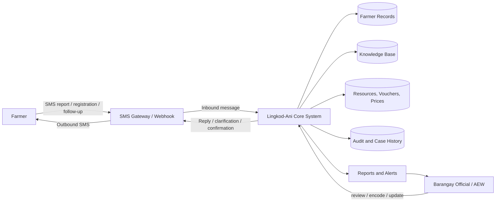

### Figure 26. Data Flow Diagram Level 1

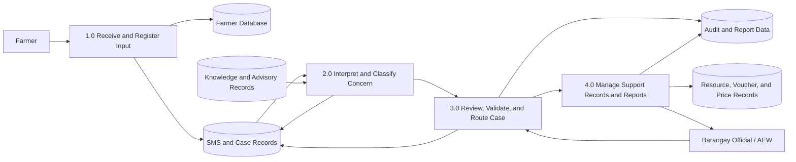

### Figure 27. Data Flow Diagram Level 2 for SMS Intake and Interpretation

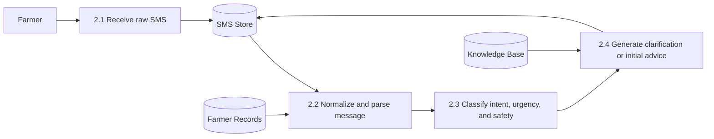

### Figure 28. Data Flow Diagram Level 3 for Review, Validation, and Follow-up

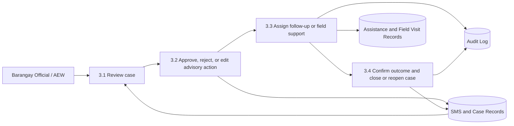

### Figure 29. Use Case Diagram of Lingkod-Ani

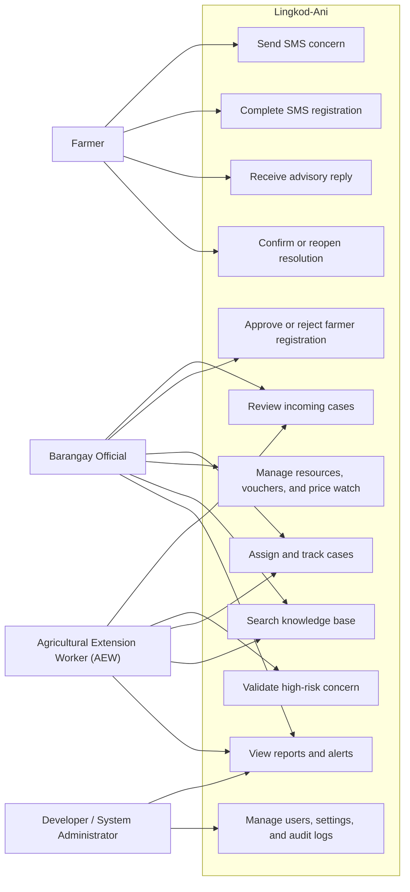

### Figure 30. Fishbone Diagram of the Advisory Problem Addressed by Lingkod-Ani

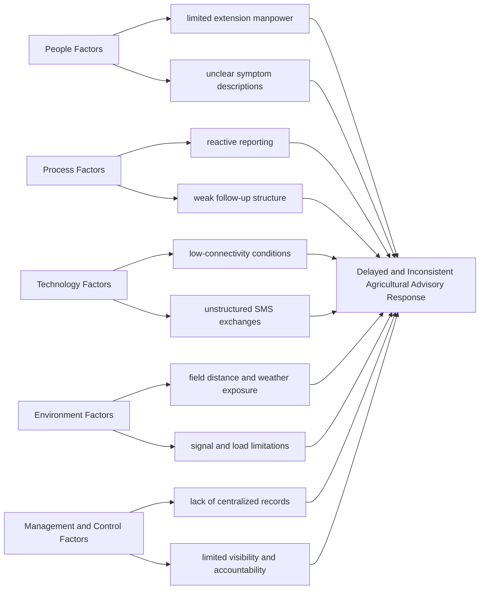

## System Architecture

Lingkod-Ani follows a web-based, SMS-assisted, cloud-supported architecture. Farmers interact through SMS-capable phones, while barangay users and the AEW interact through a browser-based dashboard. The application layer handles interface rendering, workflow control, and repository-based data access. AI-assisted interpretation is handled through orchestrated language-processing flows, while persistent records are stored in backend services. The architecture also preserves separation between demo preview operation and live authenticated operation, allowing safe simulation without contaminating real records.

### Figure 31. System Architecture of Lingkod-Ani

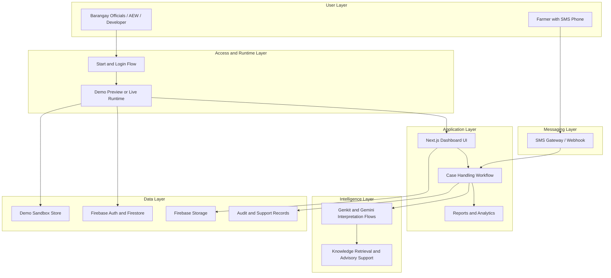

## Network Model

The logical network model of Lingkod-Ani connects farmers, dashboard users, web hosting, backend services, and SMS transport. Farmers interact through the GSM network using standard SMS, while administrative users access the web dashboard over the internet. The application itself is hosted as a web service and communicates with backend data services and message-processing endpoints. This model supports centralized case handling without requiring on-premise barangay server infrastructure.

### Figure 32. Network Model of Lingkod-Ani

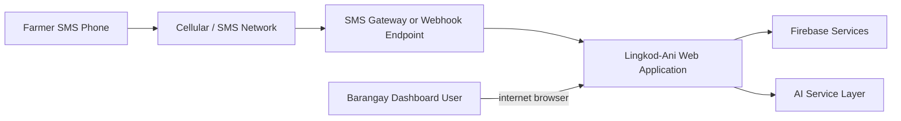

## Network Topology

From a deployment perspective, Lingkod-Ani follows a cloud-centered star topology. The hosted application and backend services serve as the central nodes, while farmer devices, dashboard users, and gateway integrations act as connecting endpoints. This topology is appropriate for the project because it reduces the need for local infrastructure and supports centralized monitoring, updating, and data management.

### Figure 33. Network Topology of Lingkod-Ani

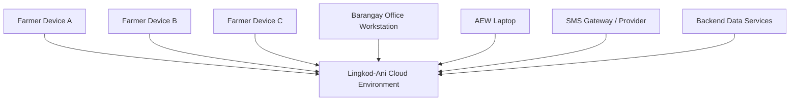

## Development Plan

The development of Lingkod-Ani followed an iterative plan consistent with Agile principles. The work began with problem analysis and requirements gathering, followed by design modeling, module development, integration of AI-assisted and SMS-related workflows, prototype testing, user-oriented evaluation, and refinement. This approach supported repeated adjustment of the system based on scenario behavior, QA observations, and stakeholder feedback rather than freezing the project too early.

### Figure 34. Development Plan of Lingkod-Ani

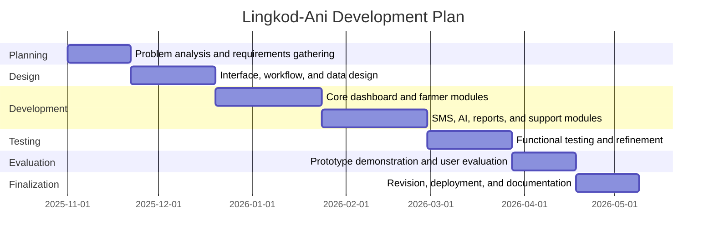

If your actual project log uses different dates, keep the phases and replace the dates with your real timeline.

## Software Specification

Lingkod-Ani was implemented as a modern web-based information system using a TypeScript and React-centered ecosystem. The application layer was developed using Next.js with the App Router, while interface styling and interaction relied on Tailwind CSS and Radix UI-based components. Data validation used React Hook Form and Zod. For reports and analytics, the system used charting libraries suitable for interactive dashboards. For live-capable backend operation, the system used Firebase technologies for authentication and cloud data services. AI-assisted interpretation and knowledge-support workflows were orchestrated through Genkit with Google Gemini models.

### Table 41. Software Specification of Lingkod-Ani

| Software Component | Purpose |
|---|---|
| `Next.js 15.5.9` | web framework and routing |
| `React 19` | component-based interface rendering |
| `TypeScript 5` | static typing and maintainability |
| `Tailwind CSS` | utility-based styling |
| `Radix UI / ShadCN UI` | accessible interface components |
| `React Hook Form` | form state handling |
| `Zod` | validation schema support |
| `Recharts` | report and analytics charts |
| `Firebase` | authentication and live-capable data services |
| `Firebase Admin` | server-side administrative integration |
| `Genkit` | AI workflow orchestration |
| `Google Gemini` | AI-assisted language and advisory processing |
| `Jest` | test execution |
| `ESLint` | code quality checking |

## Hardware Specification

Lingkod-Ani does not require specialized end-user hardware. On the farmer side, the minimum requirement is an SMS-capable mobile phone. On the administrative side, the system may be operated through standard desktop computers or laptops with internet access and a modern browser. Because the system is cloud-hosted and live-capable rather than dependent on local server installation, hardware demands at the barangay level remain modest. For real SMS deployment, a compatible SMS gateway provider or device setup is additionally required.

### Table 42. Hardware Specification of Lingkod-Ani

| Hardware Item | Suggested Requirement | Purpose |
|---|---|---|
| Farmer phone | SMS-capable basic phone or smartphone | send concerns and receive replies |
| Barangay workstation | dual-core processor or better, 8 GB RAM, browser access | dashboard operation |
| AEW laptop | dual-core processor or better, 8 GB RAM, browser access | validation and field coordination |
| Internet connection | stable connection for dashboard users | live-capable syncing and access |
| SMS gateway setup | provider account or compatible gateway device | real inbound and outbound SMS handling |

## Security

The security design of Lingkod-Ani combines authentication, role-aware access control, auditability, and workflow safeguards. Live-capable access is restricted to authenticated users, and sensitive actions are associated with specific roles, permission checks, or operational constraints. The system also preserves separation between demo preview data and live records to avoid cross-environment contamination during presentation or testing. On the advisory side, safety is strengthened through a human-in-the-loop mechanism in which serious, unclear, or higher-risk concerns are escalated for review rather than treated as fully resolved by automation alone. These controls support both data privacy and operational accountability in line with the requirements of barangay-level public service systems.

### Table 43. Security Controls of Lingkod-Ani

| Security Area | Implemented Control | Purpose |
|---|---|---|
| Authentication | live sign-in flow and account-linked profile records | restrict access to authorized users |
| Authorization | role-based and permission-aware UI and backend checks | limit sensitive actions to permitted users |
| Demo or Live separation | sandboxed demo preview with reset-after-logout behavior | prevent demo data from mixing with live records |
| Auditability | historical logs and operational trace records | preserve accountability and traceability |
| Advisory safety | human validation for serious or unclear cases | prevent unsafe overreliance on automation |
| Data handling | structured backend records and controlled profile updates | preserve record integrity and identity consistency |

## Program Specification

Programmatically, Lingkod-Ani accepts SMS input and administrative form input, processes them through rule-based and AI-assisted workflows, stores structured records, and produces outputs such as replies, alerts, reports, logs, and case-state changes. The program logic includes runtime mode selection, farmer record management, message interpretation, concern routing, profile updates, resource and voucher transactions, price watch management, reporting computations, and audit-support behavior. This allows the system to function not merely as a message receiver but as a coordinated agricultural operations information system.

## Programming Environment

The programming environment of Lingkod-Ani consisted of a Node.js-based web development stack with local development, type checking, linting, and test tooling. The system was developed using a TypeScript-compatible editor environment, package management through npm, and cloud deployment through Vercel for the web application. Backend configuration and live-capable service integration were supported through Firebase-related tooling. This environment enabled iterative prototyping, verification, and deployment while keeping the system maintainable for future enhancement.

### Table 44. Programming Environment of Lingkod-Ani

| Environment Component | Application in the Project |
|---|---|
| Operating environment | local desktop development and cloud web deployment |
| Language layer | TypeScript, JavaScript |
| Interface framework | React and Next.js |
| Styling environment | Tailwind CSS |
| Backend service environment | Firebase Auth, Firestore, and related cloud services |
| AI workflow environment | Genkit and Gemini model integration |
| QA environment | type checking, linting, browser-based testing, Jest |
| Deployment environment | Vercel for the web app and Firebase for supporting live services |

## Test Plan

The test plan of Lingkod-Ani was designed to examine both workflow correctness and practical usability. Testing focused on message intake, farmer registration behavior, approval and deletion actions, inventory and voucher state changes, price watch updates, report-generation behavior, profile updating, demo/live separation, and the overall consistency of the case workflow. The plan also considered safety behavior by examining how unclear or higher-risk cases are preserved for review and follow-up rather than casually closed.

### Figure 35. Test Plan Diagram of Lingkod-Ani

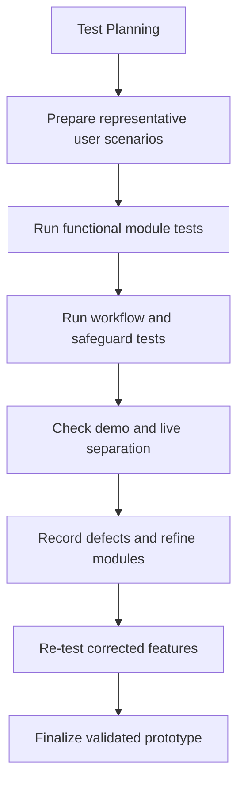

### Table 45. Test Plan Coverage of Lingkod-Ani

| Area | Planned Focus |
|---|---|
| Farmer flow | registration, approval, deletion, record persistence |
| SMS flow | inbound simulation, interpretation visibility, case continuity |
| Inventory and support flow | resource editing, voucher issuance and redemption |
| Market support flow | price watch editing and reporting consistency |
| Reporting flow | chart visibility and print or save behavior |
| Account flow | profile updates, workspace preference, avatar handling |
| Mode boundary | demo reset after logout and non-mixing of live and demo data |

## Testing

Testing of Lingkod-Ani combined controlled prototype checks, interface-level action testing, and scenario-based validation. The system was examined not only for whether individual buttons worked, but also for whether actions remained consistent across the wider workflow. For example, testing considered whether a registered farmer appears in the approval queue, whether an approved farmer appears in the farmer database, whether simulated inbound SMS messages appear in reports and case views, whether edits persist across related records, and whether demo data resets correctly after logout.

## System Testing

System testing verified the integrated behavior of Lingkod-Ani across its major modules. Demo-side testing confirmed the operability of simulated SMS intake, farmer registration, farmer approval, farmer deletion, profile image upload in sandbox mode, inventory editing, voucher redemption, price watch editing, reports print or save behavior, and demo data reset after logout. Live-capable testing confirmed production deployment, route accessibility, and updated Firestore rules, while also identifying infrastructure-dependent items such as Firebase Storage initialization and real SMS gateway readiness as external deployment prerequisites rather than core interface defects. This distinction is important because it shows that the application logic and interface workflows may be correct even when specific live services still require configuration.

### Table 46. System Testing Summary of Lingkod-Ani

| Module or Workflow | Current Result | Remarks |
|---|---|---|
| Demo preview start flow | Passed | user can enter sandboxed demo session |
| Simulated inbound SMS | Passed | reflected in demo views and session data |
| Farmer registration | Passed | registration enters approval path |
| Farmer approval | Passed | approved farmer moves into main records |
| Farmer deletion | Passed | record can be removed with working confirmation flow |
| Inventory edit | Passed | edited resource names persist in the demo session |
| Voucher redemption | Passed | voucher state updates correctly |
| Price watch edit | Passed | edits save and reflect in the record table |
| Reports print or save behavior | Passed | browser print dialog opens |
| Demo reset after logout | Passed | sandbox data returns to seeded state |
| Live profile image upload | Conditional | requires configured Firebase Storage and rules |
| Real SMS transport | Conditional | requires provider credentials, routing, and service readiness |

# CHAPTER 5
# CONCLUSION AND RECOMMENDATIONS

## Conclusion

The study concludes that Lingkod-Ani is a relevant and technically coherent response to the communication and coordination problems faced in barangay-level agricultural advisory work. The findings demonstrated that the existing environment in Barangay Batakil is characterized by delayed consultation, unclear concern reporting, weak tracking, and limited operational continuity. In response, Lingkod-Ani was developed as an AI-assisted, SMS-first, human-validated, and dashboard-supported agricultural advisory and management platform designed to improve the flow from farmer concern to monitored barangay action.

The system’s strongest contribution lies in its ability to convert fragmented communication into a structured operational workflow. Rather than functioning only as an SMS inbox or automated reply tool, Lingkod-Ani connects farmer reporting, AI-assisted interpretation, clarification handling, escalation, dashboard review, support management, and follow-up continuity within a single information system. This structure is especially valuable in low-connectivity rural settings where farmers may not have access to smartphones or continuous internet service, but still require timely and practical access to agricultural support.

At the prototype level, the evaluation results further indicate that Lingkod-Ani is not only conceptually appropriate but also functionally credible. The system performed consistently in representative workflow scenarios and safeguard checks, and respondents strongly accepted the platform in terms of functionality, perceived ease of use, perceived usefulness, and trust, safety, and management support. These findings suggest that the system aligns not only with the technical requirements of agricultural concern handling, but also with the practical expectations of its intended users.

At the same time, the study also establishes an important boundary. Lingkod-Ani should not be interpreted as a fully autonomous agricultural advisory authority. Its long-term value depends on maintaining human validation for serious or unclear cases, preserving accountability for official actions, and ensuring that live deployment components such as storage services and SMS transport are properly configured. In this sense, the system is most appropriately understood as a decision-support and coordination platform that strengthens barangay agricultural service delivery rather than replaces agricultural expertise.

Overall, Lingkod-Ani demonstrates that an SMS-first agricultural information system can go beyond basic communication and support a more organized, visible, and accountable advisory workflow at the barangay level. Its most meaningful contribution is not merely faster messaging, but the integration of accessibility, interpretation, review, tracking, and follow-up continuity into one coherent agricultural operations platform. For these reasons, the study concludes that Lingkod-Ani is both academically defensible and practically promising as a prototype-level, live-capable system for low-connectivity agricultural communities.

## Recommendations

Based on the findings of the study and the current technical state of the system, several recommendations are proposed for future implementation and enhancement of Lingkod-Ani.

First, future development should prioritize longer-term field deployment and operational observation. While the present study provides strong prototype-level evidence, longer real-world use would allow the system to be evaluated under repeated advisory cycles, actual staffing conditions, and sustained farmer interaction. This would strengthen the evidence base for long-term adoption and reveal additional workflow improvements that may not emerge in short demonstration-based evaluation.

Second, future implementation should continue to preserve the human-in-the-loop design of the system. This is especially important for serious, unclear, or high-risk cases where automated interpretation alone may not be sufficient. Maintaining human oversight will help preserve safety, trust, and contextual accuracy, particularly in livelihood-sensitive situations where inappropriate advice may affect production outcomes and household income.

Third, technical deployment readiness should be strengthened further before broader live use. This includes ensuring that cloud storage services, backend rules, SMS gateway credentials, and related live infrastructure are fully configured and documented. These steps are necessary so that live-capable features such as persistent media upload and real SMS transport are not only implemented in code, but also operationally dependable in practice.

Fourth, the knowledge and reporting layers of the system may be expanded. The knowledge base can be enriched with more localized agricultural guidance, seasonal case references, and validated crop-support content. The reports module may likewise be enhanced through stronger export options, richer operational summaries, and more formal decision-support outputs for barangay planning and intervention tracking.

Fifth, future work may explore broader organizational rollout beyond the pilot context. Once the system is sufficiently stabilized, Lingkod-Ani may be adapted for use in additional barangays or higher-level local government contexts, provided that governance structures, staffing roles, and data-handling policies are clearly established. Such expansion should remain sensitive to local differences in connectivity, staffing patterns, and advisory needs.

Finally, future research may involve a larger respondent base and longer evaluation duration. This would improve the robustness of both qualitative and quantitative findings and allow the researchers to examine not only immediate acceptability, but also routine use behavior, trust development over time, and the evolving role of the system in agricultural coordination and local public service delivery.

In summary, Lingkod-Ani should be carried forward not as a static finished artifact, but as a strong prototype foundation for a safer, more structured, and more responsive barangay agricultural advisory platform.

## References

### Reference Alignment Note

The entries below match the in-text citations currently visible in the working Lingkod-Ani manuscript. Several institutional and widely identifiable sources are included in final-ready form. For the remaining author-year citations that are already mentioned in the manuscript but whose full bibliographic lines are not exposed in the working document copy, the exact adviser-approved source details should be checked against the team’s original literature matrix before final printing to ensure perfect one-to-one alignment.

Aker, J. C. (2011). Dial “A” for agriculture: Using information and communication technologies for agricultural extension in developing countries. *Agricultural Economics, 42*(6), 631–647.

Alampay, E. A., [verify co-authors], & [verify exact title]. (2019). [Verify exact source used in the approved literature matrix regarding extension communication or agricultural advisory access in the Philippines].

Banayo, N. P. M., [verify co-authors], & [verify exact title]. (2017). [Verify exact source used in the approved literature matrix regarding crop management, nutrient imbalance, or advisory limitations in Philippine farming contexts].

Briones, R. M., Galang, I. M., & Latigar, J. A. M. (2023). *Transforming Philippine agri-food systems with digital technology: Extent, prospects, and inclusiveness*. Philippine Institute for Development Studies.

Commission on Higher Education. (2015). *CHED Memorandum Order No. 25, series of 2015: Revised policies, standards and guidelines for Bachelor of Science in Information Technology (BSIT)*.

Donner, J. (2008). Research approaches to mobile use in the developing world: A review of the literature. *The Information Society, 24*(3), 140–159.

Food and Agriculture Organization of the United Nations. (2022). *The State of Food and Agriculture 2022: Leveraging automation in agriculture for transforming agrifood systems*. FAO.

Philippine Institute for Development Studies. (2023). *Digital technology adoption in Philippine agriculture* [verify exact title if different from the source used in the draft].

Republic Act No. 10173. (2012). *Data Privacy Act of 2012*. Republic of the Philippines.

Sarkar, [verify initials], et al. (2023). [Verify exact source used in the approved literature matrix regarding human-in-the-loop validation, accountability, or contextual safety in AI-assisted systems].

Sharma, [verify initials], et al. (2021). [Verify exact source used in the approved literature matrix regarding agricultural advisory delays, crop misdiagnosis, or avoidable farm losses].

## Final Chapter Note

For thesis defense, the strongest positioning is to present Chapter 4 as technical documentation that directly explains how the implemented Lingkod-Ani system answers the agricultural communication problem identified in the study, and to present Chapter 5 as a tightly reasoned closing chapter that connects the technical system, the evaluation results, and the real conditions of barangay agricultural operations. This will make the manuscript more coherent, more defensible, and more technically grounded than a generic capstone document.
