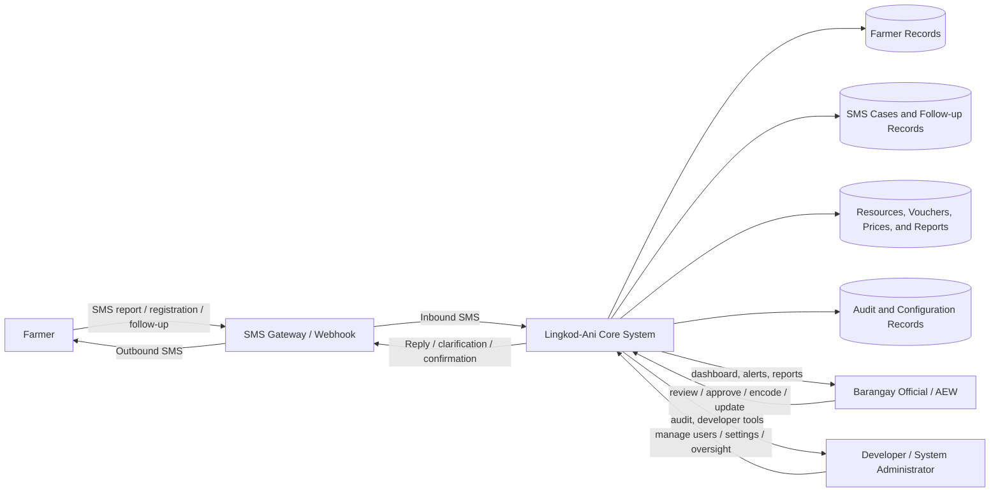
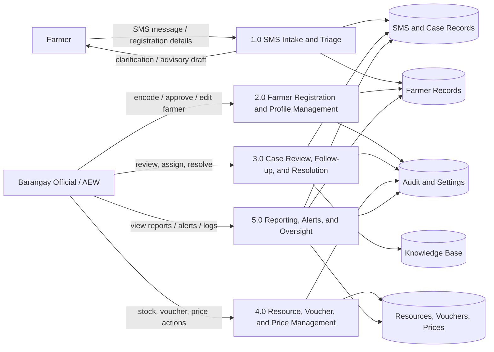
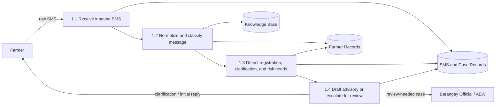
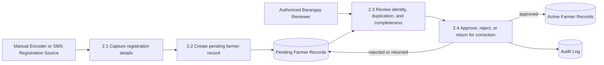
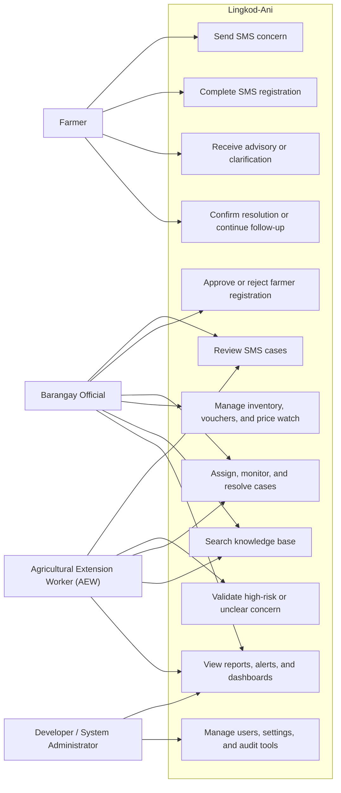
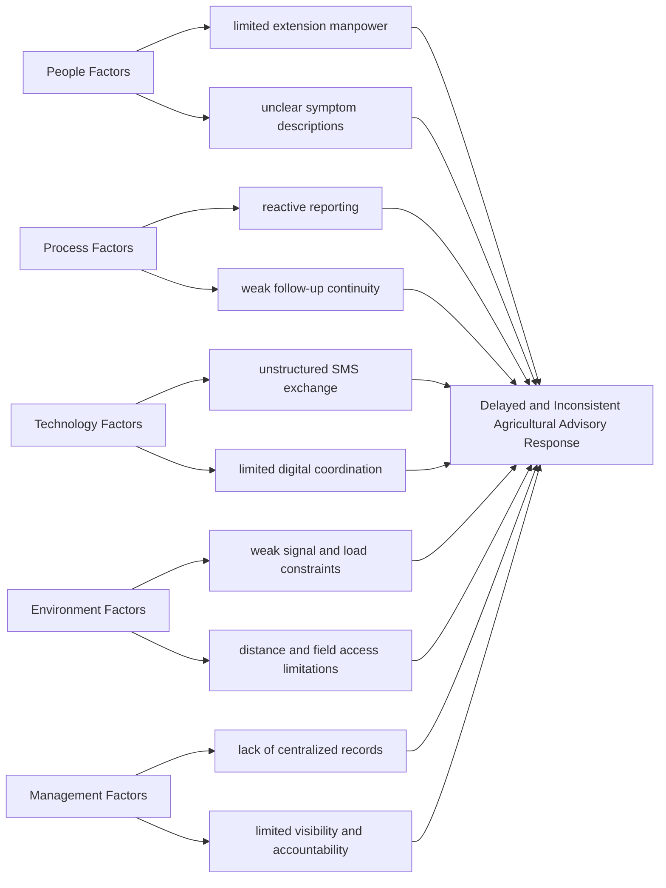
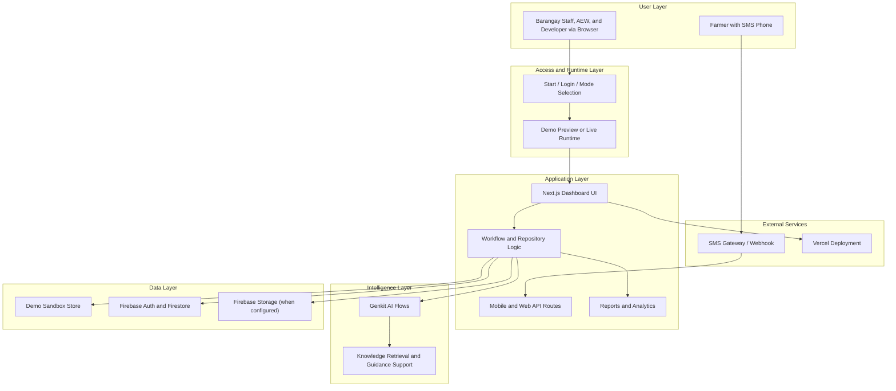
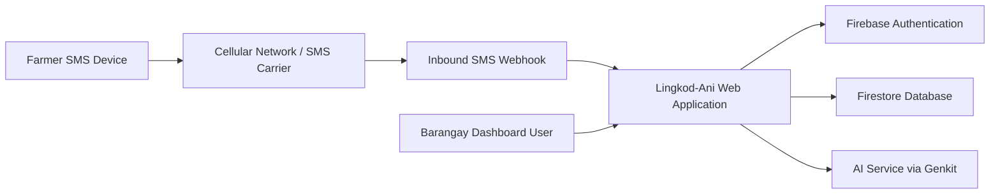
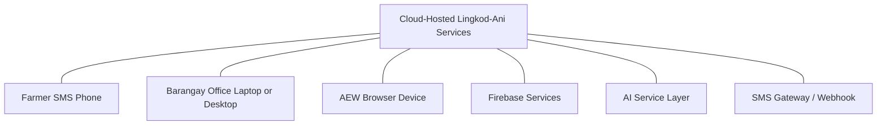
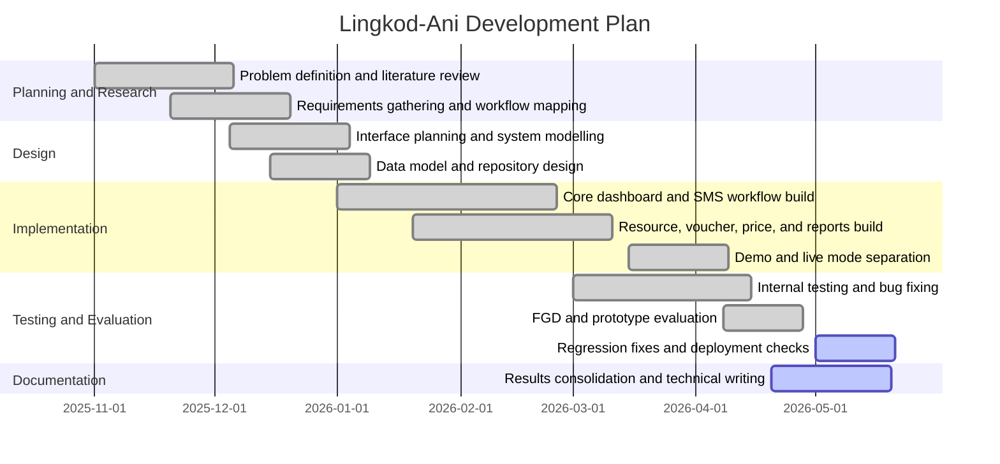

# CHAPTER 4
# SYSTEM DESIGN, IMPLEMENTATION, AND TECHNICAL DOCUMENTATION

## Chapter Overview

This chapter presents the full system design, implementation structure, and technical documentation of Lingkod-Ani. While the previous chapter established the research findings, prototype evaluation results, and acceptability of the system, the present chapter documents how Lingkod-Ani was actually designed as an SMS-first, AI-assisted, human-validated, dashboard-supported agricultural operations and advisory platform for Barangay Batakil. The chapter covers the design of the main modules, operational forms, reports, data structures, requirements, feasibility considerations, system models, architecture, network layout, specifications, security controls, development plan, testing approach, and alignment notes necessary for thesis defensibility.

Unlike generic system documentation chapters that merely list screens and technical terms, this chapter is anchored directly to the actual application modules, routes, entities, and workflows implemented in the current Lingkod-Ani project. In this way, the chapter not only satisfies documentation requirements commonly seen in other capstone manuscripts, but also strengthens the traceability of the thesis by showing that the documented system is the same system that was evaluated, tested, deployed, and discussed in the earlier chapters.

Lingkod-Ani was designed to support two distinct operational contexts. The first is a sandboxed demo mode intended for safe demonstration, walkthroughs, mock case simulation, and academic evaluation. The second is a live-capable mode intended for authenticated, Firebase-backed operation by authorized users. This separation is important to the design because the project needed to support realistic testing and defense presentations without contaminating live data, while still preserving a deployment path for actual barangay use. Across both modes, the core design remains the same: SMS-first reporting, AI-assisted interpretation, human review for sensitive cases, dashboard-based coordination, follow-up continuity, and operational reporting.

## 4.1 Design Orientation and Interface Logic

The interface design of Lingkod-Ani follows a task-centered information systems approach. Each module is not simply a stand-alone screen, but part of an operational flow that begins with intake, continues through review and action, and ends in reporting, follow-up, or documented closure. This design orientation is important for the barangay agricultural setting because the communication problem identified in the study was not limited to message sending alone. The deeper problem involved delayed reporting, poor continuity, unclear case ownership, limited visibility, and inconsistent follow-up. As a result, the interface was designed around work continuity rather than isolated features.

At the interface level, Lingkod-Ani uses a browser-based dashboard for administrative users and an SMS-facing workflow for farmer-side communication. The administrative side organizes work into case review, farmer management, resource coordination, price updates, knowledge support, reporting, and operational oversight. The farmer side remains intentionally lightweight, because the system is designed to be usable even by farmers with basic phones. This makes the overall design more context-appropriate than a smartphone-only or app-download-dependent solution.

### Table 26. Interface-to-Route Alignment of Lingkod-Ani

| Module | Route or Entry Point | Main User | Operational Purpose |
|---|---|---|---|
| Start and mode selection | `/start` | Demo and live users | Separates demo preview from live application access |
| Login module | `/login` | Authorized live users | Authenticates users for live-capable dashboard access |
| Operations dashboard | `/dashboard/operations` | Barangay staff and AEW | Displays operational summary, queues, and alerts |
| SMS feed | `/dashboard/sms-feed` | Barangay staff and AEW | Reviews inbound concerns, AI analysis, and case actions |
| Farmer registration | `/dashboard/farmers/register` | Barangay staff | Encodes new farmer profiles |
| Farmer approvals | `/dashboard/farmers/approvals` | Authorized barangay staff | Reviews pending farmer registrations |
| Farmer database | `/dashboard/farmers` | Barangay staff and AEW | Views and manages approved farmer records |
| Inventory | `/dashboard/inventory` | Barangay staff | Manages resource stock and support items |
| Vouchers | `/dashboard/vouchers` | Barangay staff | Issues, tracks, and redeems support vouchers |
| Price watch | `/dashboard/price-watch` | Barangay staff | Maintains local crop price references |
| Knowledge base | `/dashboard/knowledge-base` | Barangay staff and AEW | Searches and reviews advisory knowledge resources |
| Reports | `/dashboard/reports` | Barangay staff, AEW, developer | Visualizes trends and operational performance |
| Account settings | `/dashboard/account` | All authenticated users | Manages user identity and preferences |
| Developer and oversight tools | `/dashboard/developer`, `/dashboard/oversight`, `/dashboard/data-center` | Developer or advanced administrators | Maintains system-level records, users, and data review |

### Screenshot Capture Guide

Use actual Lingkod-Ani screenshots only. Do not use wireframes, placeholder mockups, or edited composites. If a screenshot is captured in demo mode, keep the mode badge visible whenever possible so the panel can see that the screen is being demonstrated in a sandboxed environment. The figure sequence below continues after the existing Results and Discussion figures, so Chapter 4 begins at Figure 12.

### Table 27. Screenshot Plan and Operational Captions for Chapter 4 Interface Figures

| Figure No. | Screen to Capture | Route | What to Show in the Screenshot | Final Figure Caption |
|---|---|---|---|---|
| Figure 12 | Start page and mode selection | `/start` | Demo Application, Live Application, persona or workspace chooser | This figure shows the start page of Lingkod-Ani where users choose between the demo application and the live application and complete the initial preview or workspace-selection flow. |
| Figure 13 | Login module | `/login` | Email and password fields, access request option, live sign-in context | This figure presents the login module of Lingkod-Ani used by authorized users to access the live-capable dashboard environment. |
| Figure 14 | Operations dashboard | `/dashboard/operations` | Summary cards, alert banners, pending counts, queue widgets | This figure presents the operations dashboard of Lingkod-Ani, which summarizes active concerns, pending actions, and operational priorities for barangay users. |
| Figure 15 | SMS feed and case review | `/dashboard/sms-feed` | Inbound SMS cards, AI interpretation, urgency, safety flag, reply or assignment actions | This figure shows the SMS feed module where incoming farmer messages are reviewed together with AI-assisted interpretation, urgency classification, and case-handling actions. |
| Figure 16 | Farmer registration form | `/dashboard/farmers/register` | Full registration form with personal, location, and crop fields | This figure presents the farmer registration form used to encode and submit a new farmer profile for administrative review and approval. |
| Figure 17 | Pending farmer approval | `/dashboard/farmers/approvals` | Pending list, review panel, approve or reject controls | This figure shows the farmer approval module where pending farmer registrations are reviewed before inclusion in the active farmer database. |
| Figure 18 | Farmer database | `/dashboard/farmers` | Active farmer list, search, filters, edit or delete actions | This figure presents the farmer database module used to view, search, update, and manage approved farmer records. |
| Figure 19 | Resource inventory | `/dashboard/inventory` | Resource table, stock levels, add or edit dialog | This figure shows the resource inventory module used to manage barangay agricultural resources, stock levels, and category-based support items. |
| Figure 20 | Voucher management | `/dashboard/vouchers` | Voucher table, issue action, redeem or check action | This figure presents the voucher management module used to issue, monitor, and redeem agricultural support vouchers. |
| Figure 21 | Price watch | `/dashboard/price-watch` | Price list and the edit form used after pressing Edit | This figure shows the price watch module used to record and update local crop price references for common agricultural commodities. |
| Figure 22 | Knowledge base | `/dashboard/knowledge-base` | Search interface, articles, and advisory lookup content | This figure presents the knowledge base module where users retrieve stored agricultural guidance and supporting advisory information. |
| Figure 23 | Reports dashboard | `/dashboard/reports` | Summary cards, charts, analytics panels, and `Print / Save as PDF` button | This figure shows the reports and analytics dashboard used to visualize operational trends, case patterns, and communication activity in Lingkod-Ani. |
| Figure 24 | Account and profile settings | `/dashboard/account` | Profile fields, avatar area, workspace or identity settings | This figure presents the account and profile settings module where users manage their identity information, workspace preference, and account settings. |

### Login Module

The login module of Lingkod-Ani was designed primarily for the live-capable side of the system. Its function is not only to authenticate users, but also to preserve role-aware access to protected operational features such as farmer approval, case handling, records management, and system settings. In contrast to the demo-side preview, the live login path serves as the boundary between public-facing introduction and authenticated administrative operation. This boundary is important because the system handles potentially sensitive personal data, case notes, and operational decisions that should not be exposed to unauthorized users.

From a design standpoint, the login module also supports continuity into access-request and onboarding workflows. This is consistent with barangay use, where a user may not always already be provisioned in advance. The module is therefore better understood as part of user access governance rather than as a simple credential form.

### Homepage or Dashboard Module

The dashboard module serves as the main operational homepage of Lingkod-Ani. It was designed to compress multiple streams of agricultural operations into a single decision-support surface. Instead of requiring users to open multiple pages just to understand current workload, the dashboard exposes alerts, pending farmer approvals, case counts, follow-up indicators, inventory concerns, and overall activity summaries in one coordinated view. This supports faster situational awareness and is especially useful when extension manpower is limited.

The dashboard is also designed to bridge short-term and medium-term work. At a glance, it supports immediate action by surfacing pending or overdue concerns. At the same time, it supports management-level reflection by exposing trend indicators and summaries that can later feed into the reports module. In this sense, the dashboard is not merely a homepage, but the control center of the system.

### Other Important Modules

In addition to login and dashboard access, Lingkod-Ani includes several operational modules that materially support the study problem. The SMS feed operationalizes the intake and case-review process identified as necessary in the study. The farmer modules formalize registration, approval, database management, and profile continuity. The inventory, voucher, and price watch modules support resource and decision coordination. The knowledge base supports advisory retrieval and consistency, while the reports module transforms accumulated records into visible managerial insight. Developer, oversight, and data-center tools extend the system beyond ordinary CRUD into institutional monitoring, training, and administrative control.

A major design strength of the current app is that these modules are connected through shared data, not merely grouped together visually. When demo or live records are updated successfully, the effects propagate across related lists, counts, cases, and reports. This design characteristic is important because it directly addresses the earlier issue of fragmented communication and weak continuity in barangay operations.

## 4.2 Forms and Reports

### Forms

The forms in Lingkod-Ani were designed to minimize encoding friction while still capturing the minimum information needed for reliable agricultural advisory coordination. Most forms use clear labels, constrained field choices, and direct save or submit actions because barangay users often work under time pressure and may not have the time or confidence to complete long technical forms. Validation behavior is therefore part of the system design and not a mere implementation detail.

The forms also reflect the actual operational steps in the system. Farmer registration captures identity, location, and crop context. Profile forms support identity maintenance for system users. Inventory forms capture category, stock, unit, and purpose. Voucher forms link support transactions to both farmers and resources. Price watch forms capture crop, price, source, and market trend. These are all forms that directly support the workflow studied in the thesis.

### Table 28. Core Operational Forms in Lingkod-Ani

| Form | Main Fields | Operational Purpose | Notes for Documentation |
|---|---|---|---|
| User login form | email, password | Authenticates authorized live users | Show on Figure 13 |
| Demo preview identity form | preview name, phone, workspace | Creates a sandboxed demo persona | Mention that demo resets after logout |
| Farmer registration form | name, age, gender, phone, barangay, sitio, farm size, crops | Creates a pending farmer record | Show on Figure 16 |
| Farmer approval form or review panel | pending profile details, review action, remarks | Approves or rejects encoded or SMS-based registrations | Show on Figure 17 |
| Farmer edit form | editable farmer profile fields | Maintains current farmer records | Use Figure 18 if edit panel is visible |
| Inventory create or edit form | resource name, category, group, stock, unit | Maintains resource availability and labels | Show on Figure 19 |
| Voucher issuance form | farmer, resource, quantity, code | Creates a voucher linked to a farmer and resource | Mention in voucher module discussion |
| Voucher redeem or check action | voucher code, redeem confirmation | Confirms support redemption and deducts stock | Mention prevention of repeated redeem clicks |
| Price watch edit form | crop, price, unit, source, trend | Updates market reference entries | Show the top edit form on Figure 21 |
| Account profile form | name, phone, title, avatar | Maintains authenticated user identity | Show on Figure 24 |

### Reports

The reporting layer of Lingkod-Ani was designed as an operational decision-support component rather than a decorative analytics layer. Its purpose is to convert accumulated cases, follow-up histories, resource actions, and message activity into insight that can guide barangay response. This includes summaries of SMS volume, advice and reply patterns, issue distribution, crop-stage patterns, and operational outputs. The reports help users see recurring conditions rather than only isolated incidents.

The current application uses chart-based summaries and a browser-based `Print / Save as PDF` workflow for export-oriented presentation. For thesis alignment, this wording should be kept accurate. The current live application supports printable reports, but should not be described as a full server-side PDF generation engine unless that feature is later implemented as an actual downloadable document renderer.

### Table 29. Reports and Analytics Outputs in Lingkod-Ani

| Report or Visualization | Likely Source Records | Decision-Support Value | Documentation Note |
|---|---|---|---|
| SMS volume chart | SMS messages by date or period | Shows communication activity and workload trends | Capture in Figure 23 |
| Advice or reply summary | reviewed SMS and outbound messages | Shows advisory throughput and responsiveness | Mention as operational analytics |
| Crop-stage analytics | SMS triage and crop stage fields | Shows pattern clustering by crop condition stage | Mention that this uses stored case analysis |
| Keyword or topic distribution | message content and interpretation metadata | Highlights common concern patterns | Useful for recurring issue analysis |
| Alert summaries | alert history records | Supports barangay situational awareness | Mention alongside dashboard alerts |
| Follow-up and closure indicators | case status and follow-up fields | Shows case continuity and pending workload | Supports extension accountability |
| Printable report view | report screen plus browser print flow | Supports presentation and documentation output | Keep wording as `Print / Save as PDF` |

## 4.3 Full Thesis-Style Data Dictionary

The data structures of Lingkod-Ani were designed to support end-to-end concern intake, review, coordination, reporting, and traceability. The system stores user accounts, farmer records, SMS messages, outbound replies, resources, vouchers, market prices, knowledge assets, alerts, field-support records, and audit events. These entities are interconnected so that a concern reported through SMS can be linked to a farmer, evaluated by a barangay user, connected to a support action, reflected in follow-up records, and surfaced in reports.

The tables below expand the core application entities into a thesis-style dictionary format with field name, data type, description, example value, and required status. The field lists emphasize operationally important fields and are aligned with the real TypeScript models used in the project.

### Table 30. User Entity Dictionary

| Field Name | Data Type | Description | Example Value | Required |
|---|---|---|---|---|
| `id` | string | Internal record identifier or Firestore document id | `user_001` | Yes |
| `uid` | string | Firebase Authentication user id in live mode | `k9Jm3pQ2...` | Conditional |
| `email` | string | Login or contact email of the dashboard user | `aew@lingkodani.gov.ph` | Yes |
| `name` | string | Full display name of the user | `Maria Santos` | Yes |
| `role` | enum | Role classification such as `barangay` or `developer` | `barangay` | Yes |
| `title` | string | Position or office designation | `Agricultural Extension Worker` | No |
| `phone` | string | Contact number of the user | `09171234567` | No |
| `barangay` | string | Assigned barangay or service area | `Batakil` | No |
| `avatarUrl` | string | Profile image URL or data URL in demo mode | `data:image/png;base64,...` | No |
| `expertiseTags` | array of string | Tags describing domain expertise | `["rice", "pest management"]` | No |
| `assignedZones` | array of string | Geographic zones or clusters handled by the user | `["Zone 1", "Zone 2"]` | No |
| `availabilityStatus` | enum | Current operational availability of the user | `available` | No |
| `permissions` | object | Fine-grained management permissions for advanced functions | `{ "accessDataCenter": true }` | No |
| `status` | enum | Account lifecycle state | `active` | No |
| `preferredWorkspace` | enum | Preferred interface density or workspace mode | `detailed` | No |
| `onboarding` | object | Tracks setup completion steps | `{ "version": 1, "completedStepIds": ["profile_details"] }` | No |
| `createdAt` | string | Record creation timestamp | `2026-04-10T08:30:00Z` | No |
| `updatedAt` | string | Record last update timestamp | `2026-05-05T13:00:00Z` | No |
| `lastLoginAt` | string | Most recent login time | `2026-05-06T08:15:12Z` | No |

### Table 31. Farmer Entity Dictionary

| Field Name | Data Type | Description | Example Value | Required |
|---|---|---|---|---|
| `id` | string | Primary farmer record identifier | `farmer_014` | Yes |
| `name` | string | Full name of the farmer | `Juan Dela Cruz` | Yes |
| `age` | number | Farmer age | `47` | Yes |
| `gender` | string | Farmer gender value as recorded | `Male` | Yes |
| `phone` | string | Primary contact number of the farmer | `09181234567` | Yes |
| `barangay` | string | Barangay of residence or service area | `Batakil` | Yes |
| `sitio` | string | Sitio or smaller locality | `Sitio Maligaya` | Yes |
| `farmSize` | number | Farm area in hectares | `1.5` | Yes |
| `crops` | array of string | Main crops grown by the farmer | `["Palay", "Mais"]` | Yes |
| `registrationDate` | string | Date when the farmer was encoded or registered | `2026-03-22` | Yes |
| `lastSmsActivity` | string | Most recent farmer SMS activity timestamp | `2026-05-04T07:45:00Z` | Yes |
| `avatarUrl` | string | Optional farmer profile image | `https://.../farmer.jpg` | No |
| `status` | enum | Current farmer record state | `active` | Yes |
| `householdId` | string | Shared household grouping id | `HH-004` | No |
| `sharedPhone` | boolean | Indicates whether the phone is shared across household members | `true` | No |
| `profileSource` | enum | Origin of the farmer profile | `sms_self_report` | No |
| `identityTrustLevel` | enum | Confidence level in identity matching | `verified` | No |
| `duplicateRiskLevel` | enum | Record-duplication risk indicator | `none` | No |
| `profileVersion` | number | Revision number of the profile | `3` | No |
| `lastProfileReviewedAt` | string | Timestamp of latest profile review | `2026-04-28T10:30:00Z` | No |
| `archivedAt` | string | Archive time if the farmer record is retired | `2026-05-01T09:20:00Z` | No |

### Table 32. SMS Message Entity Dictionary

| Field Name | Data Type | Description | Example Value | Required |
|---|---|---|---|---|
| `id` | string | Unique inbound message identifier | `sms_20260506_001` | Yes |
| `farmerId` | string | Linked farmer identifier | `farmer_014` | Yes |
| `farmerName` | string | Cached farmer display name | `Juan Dela Cruz` | Yes |
| `phone` | string | Sender phone number | `09181234567` | Yes |
| `message` | string | Raw inbound SMS content | `May uod po sa palay namin` | Yes |
| `timestamp` | string | Inbound message timestamp | `2026-05-06T06:10:00Z` | Yes |
| `caseId` | string | Linked case thread identifier | `case_102` | No |
| `caseStatus` | enum | Workflow state of the concern | `under_review` | No |
| `assignedToUserId` | string | User id of the current owner or assignee | `user_002` | No |
| `parsedIntent` | enum | Detected message intent | `PEST_DISEASE` | Yes |
| `urgency` | enum | Urgency level of the message | `high` | Yes |
| `status` | enum | Review or reply status of the message | `approved` | Yes |
| `aiAdvice` | string | Advisory response drafted by rules or AI | `Ihiwalay muna ang apektadong bahagi...` | Yes |
| `aiConfidence` | number | Confidence value for the generated interpretation | `0.82` | Yes |
| `safetyFlag` | enum | Risk flag used for triage | `Medium` | Yes |
| `clarificationNeeded` | boolean | Indicates that more information is required | `true` | No |
| `clarificationQuestion` | string | Follow-up question to clarify the concern | `Anong bahagi ng tanim ang may sintomas?` | No |
| `cropStage` | enum | Detected crop stage | `vegetative` | No |
| `analysisSource` | enum | Source of message analysis | `ai_fallback` | No |
| `followUpDueAt` | string | Next follow-up due time | `2026-05-08T09:00:00Z` | No |
| `resolutionNote` | string | Final note when the case is resolved | `Field visit completed; symptoms managed.` | No |
| `respondedAt` | string | Time when reply was approved or sent | `2026-05-06T06:18:00Z` | No |

### Table 33. Outbound Message Entity Dictionary

| Field Name | Data Type | Description | Example Value | Required |
|---|---|---|---|---|
| `id` | string | Unique outbound message identifier | `out_20260506_014` | Yes |
| `smsMessageId` | string | Linked inbound SMS id | `sms_20260506_001` | Yes |
| `recipientPhone` | string | Destination phone number | `09181234567` | Yes |
| `audience` | enum | Indicates whether the recipient is a farmer or official | `farmer` | No |
| `purpose` | enum | Operational purpose of the outgoing message | `manual_reply` | No |
| `queuePriorityLabel` | enum | Relative queue urgency | `high` | No |
| `body` | string | Outbound message content | `Pakisuri muna ang ilalim ng dahon...` | Yes |
| `status` | enum | Delivery lifecycle state | `sent` | Yes |
| `provider` | string | SMS provider or sending channel label | `demo-simulator` | Yes |
| `providerMessageId` | string | Provider-side delivery id | `MSG-98721` | No |
| `errorMessage` | string | Error text if sending failed | `Gateway timeout` | No |
| `createdAt` | string | Record creation timestamp | `2026-05-06T06:18:00Z` | Yes |
| `sentAt` | string | Timestamp when sending was completed | `2026-05-06T06:18:05Z` | No |
| `deliveryReceivedAt` | string | Timestamp of delivery callback if available | `2026-05-06T06:19:10Z` | No |
| `attempts` | number | Number of send attempts performed | `1` | No |

### Table 34. Resource Entity Dictionary

| Field Name | Data Type | Description | Example Value | Required |
|---|---|---|---|---|
| `id` | string | Resource record identifier | `res_011` | Yes |
| `name` | string | Resource name | `Ammonium Phosphate (16-20-0)` | Yes |
| `category` | enum | High-level category of resource | `Pataba` | Yes |
| `inventoryGroup` | enum | Operational inventory grouping | `Para sa Pananim` | No |
| `subcategory` | string | More specific classification label | `Fertilizer` | No |
| `intendedUse` | enum | Intended operational use | `Pagpapalago at Pagpapataba` | No |
| `stock` | number | Available quantity | `24` | Yes |
| `unit` | string | Unit of measurement | `bags` | Yes |
| `lastUpdated` | string | Last stock or label update time | `2026-05-05T12:00:00Z` | Yes |

### Table 35. Voucher Entity Dictionary

| Field Name | Data Type | Description | Example Value | Required |
|---|---|---|---|---|
| `id` | string | Voucher record identifier | `voucher_021` | Yes |
| `farmerId` | string | Linked farmer recipient | `farmer_014` | Yes |
| `resourceId` | string | Linked resource to be claimed | `res_011` | Yes |
| `quantity` | number | Quantity covered by the voucher | `2` | Yes |
| `code` | string | Voucher code presented during checking or redemption | `UR-1A2B3C` | Yes |
| `status` | enum | Current voucher state | `issued` | Yes |
| `issueDate` | string | Date the voucher was created | `2026-05-03` | Yes |
| `redemptionDate` | string | Date the voucher was redeemed | `2026-05-06` | No |

### Table 36. Market Price Entity Dictionary

| Field Name | Data Type | Description | Example Value | Required |
|---|---|---|---|---|
| `id` | string | Price record identifier | `price_005` | Yes |
| `crop` | string | Crop or commodity label | `Palay` | Yes |
| `price` | number | Current reference price | `24` | Yes |
| `unit` | string | Unit for the price entry | `kilo` | Yes |
| `source` | string | Origin of the price information | `Pozorrubio market survey` | Yes |
| `trend` | enum | Price movement trend | `steady` | Yes |
| `updatedAt` | string | Latest update timestamp | `2026-05-05T09:00:00Z` | Yes |

### Table 37. Knowledge Article Entity Dictionary

| Field Name | Data Type | Description | Example Value | Required |
|---|---|---|---|---|
| `id` | string | Article identifier | `kb_018` | Yes |
| `title` | string | Article title | `Pamamahala ng Golden Apple Snail sa Palay` | Yes |
| `summary` | string | Short descriptive summary | `Maikling gabay sa maagang pagkontrol...` | Yes |
| `content` | string | Full article body | `Ang golden apple snail ay...` | Yes |
| `keywords` | array of string | Search and matching terms | `["palay", "kuhol", "peste"]` | Yes |
| `lastUpdated` | string | Latest revision time | `2026-04-30T16:10:00Z` | Yes |
| `author` | string | Article author or contributor | `Municipal Agriculture Office` | Yes |
| `type` | enum | Knowledge item type | `article` | Yes |
| `audioUrl` | string | Audio version file URL when applicable | `https://.../audio.mp3` | No |
| `reviewStatus` | enum | Review status of the knowledge entry | `approved` | No |
| `reviewedAt` | string | Review completion time | `2026-05-01T10:00:00Z` | No |
| `reviewedBy` | string | Reviewer name or id | `user_002` | No |
| `sourceLabel` | string | Source provenance label | `Uploaded extension memo` | No |
| `sourceType` | enum | Origin category of the article | `manual` | No |
| `version` | number | Content revision number | `2` | No |

### Table 38. Alert History Entity Dictionary

| Field Name | Data Type | Description | Example Value | Required |
|---|---|---|---|---|
| `id` | string | Alert history identifier | `alert_004` | Yes |
| `title` | string | Alert title | `Posibleng pagdami ng brown planthopper` | Yes |
| `timestamp` | string | Alert generation or sending time | `2026-05-04T14:20:00Z` | Yes |
| `type` | enum | Alert classification | `pest` | Yes |
| `severity` | enum | Severity of the alert | `Warning` | Yes |
| `validationState` | enum | Validation or confirmation state | `confirmed` | No |
| `clusterKey` | string | Grouping key for related alerts | `bph_cluster_week18` | No |
| `triggerScore` | number | Internal scoring signal for alert generation | `0.78` | No |
| `message` | string | Core alert message sent or displayed | `May pagdami ng ulat tungkol sa planthopper...` | Yes |
| `recommendation` | string | Action recommendation attached to the alert | `Magsagawa ng agarang field validation.` | Yes |
| `source` | enum | Alert origin | `manual` | Yes |
| `recipientFarmerIds` | array of string | Intended recipient farmer ids | `["farmer_014", "farmer_023"]` | Yes |
| `sentCount` | number | Number of successful sends | `18` | Yes |
| `failedCount` | number | Number of failed sends | `2` | Yes |

### Table 39. Farmer Assistance Record Entity Dictionary

| Field Name | Data Type | Description | Example Value | Required |
|---|---|---|---|---|
| `id` | string | Assistance record identifier | `assist_031` | Yes |
| `farmerId` | string | Linked farmer id | `farmer_014` | Yes |
| `relatedSmsId` | string | Related message that triggered assistance | `sms_20260506_001` | No |
| `type` | enum | Type of support provided | `Technical Advice` | Yes |
| `title` | string | Assistance label or summary | `Pest management advice` | Yes |
| `details` | string | Detailed support description | `Advised monitoring and manual collection.` | Yes |
| `quantity` | string | Quantity when support involves materials | `2 bags` | No |
| `status` | enum | Current support progression | `completed` | Yes |
| `providedBy` | string | Staff member or office that provided support | `AEW Maria Santos` | Yes |
| `createdAt` | string | Record creation time | `2026-05-06T06:30:00Z` | Yes |
| `updatedAt` | string | Latest update time | `2026-05-06T07:00:00Z` | Yes |
| `fulfilledAt` | string | Completion time | `2026-05-06T07:00:00Z` | No |
| `nextAction` | string | Next required action if still in progress | `Monitor after 48 hours` | No |
| `resourceId` | string | Resource link when material assistance is used | `res_011` | No |
| `outcomeSummary` | string | Brief outcome statement | `Farmer acknowledged instructions.` | No |
| `sourceOfTruth` | enum | Confidence source for the record | `staff_encoded` | No |

### Table 40. Field Visit Task Entity Dictionary

| Field Name | Data Type | Description | Example Value | Required |
|---|---|---|---|---|
| `id` | string | Field-visit task identifier | `visit_009` | Yes |
| `farmerId` | string | Linked farmer id | `farmer_014` | Yes |
| `title` | string | Visit title | `Field validation for pest outbreak` | Yes |
| `purpose` | string | Purpose of the visit | `Confirm symptoms and advise treatment` | Yes |
| `scheduledFor` | string | Scheduled visit date or time | `2026-05-07T08:00:00Z` | Yes |
| `assignedTo` | string | Assigned staff member | `AEW Maria Santos` | Yes |
| `priority` | enum | Priority level | `high` | Yes |
| `status` | enum | Visit lifecycle status | `scheduled` | Yes |
| `createdAt` | string | Task creation timestamp | `2026-05-06T06:40:00Z` | Yes |
| `updatedAt` | string | Last update timestamp | `2026-05-06T06:45:00Z` | Yes |
| `notes` | string | Supplemental notes | `Bring sample bag and camera.` | No |
| `verificationStatus` | enum | Verification state of the visit | `unverified` | No |
| `verificationSource` | enum | Source of verification data | `mobile_manual` | No |
| `verificationLat` | number | Latitude captured during verification | `15.7912` | No |
| `verificationLng` | number | Longitude captured during verification | `120.5410` | No |
| `observedIssue` | string | Observed field issue during visit | `Leaf scraping and missing seedlings` | No |
| `adviceGiven` | string | Advice recorded during field work | `Collect snails early morning and use barriers.` | No |
| `revisitNeeded` | boolean | Indicates whether a return visit is required | `true` | No |
| `outcomeSummary` | string | Overall result of the visit | `Initial treatment started; revisit next week.` | No |

### Table 41. Audit Log Entity Dictionary

| Field Name | Data Type | Description | Example Value | Required |
|---|---|---|---|---|
| `id` | string | Audit event identifier | `audit_120` | Yes |
| `timestamp` | string | Time when the action occurred | `2026-05-06T08:12:00Z` | Yes |
| `user` | string | User responsible for the action | `Maria Santos` | Yes |
| `action` | string | Action performed | `Approved farmer registration` | Yes |
| `details` | string | Narrative or structured detail of the action | `Approved farmer_014 from pending queue.` | Yes |
| `category` | enum | Audit category | `operations` | No |
| `severity` | enum | Severity classification | `info` | No |
| `reasonRequired` | boolean | Indicates whether justification is required | `false` | No |
| `reasonProvided` | string | User-supplied reason when required | `Duplicate cleanup` | No |
| `beforeSnapshot` | object | Pre-change value snapshot | `{ "status": "pending_approval" }` | No |
| `afterSnapshot` | object | Post-change value snapshot | `{ "status": "active" }` | No |
| `securitySensitive` | boolean | Marks privacy or security relevance | `true` | No |
| `retentionRedactedAt` | string | Redaction time if retention policy is applied | `2027-05-06T00:00:00Z` | No |

### Table 42. Access Request Entity Dictionary

| Field Name | Data Type | Description | Example Value | Required |
|---|---|---|---|---|
| `id` | string | Access request identifier | `access_007` | Yes |
| `email` | string | Requesting user's email | `new.staff@lingkodani.gov.ph` | Yes |
| `name` | string | Requesting user's full name | `Ana Reyes` | Yes |
| `phone` | string | Requesting user's contact number | `09179998888` | No |
| `barangay` | string | Barangay affiliation | `Batakil` | No |
| `title` | string | Position or office title | `Barangay Secretary` | No |
| `message` | string | Optional explanatory request message | `Need access for report monitoring.` | No |
| `source` | enum | Where the request originated | `login` | No |
| `normalizedPhone` | string | Cleaned phone number for duplicate control | `639179998888` | No |
| `status` | enum | Current request state | `pending_review` | Yes |
| `requestedAt` | string | Initial request timestamp | `2026-05-06T09:00:00Z` | Yes |
| `lastSubmittedAt` | string | Most recent submission timestamp | `2026-05-06T09:02:00Z` | No |
| `submissionCount` | number | Number of submission attempts | `1` | No |
| `reviewedAt` | string | Review timestamp | `2026-05-06T11:30:00Z` | No |
| `reviewedBy` | string | Reviewer identity | `developer_001` | No |

### Table 43. System Settings Entity Dictionary

| Field Name | Data Type | Description | Example Value | Required |
|---|---|---|---|---|
| `id` | string | Settings document identifier | `system_settings_default` | Yes |
| `brgyDescription` | string | Barangay description shown in system context | `Rice-based farming barangay with low-connectivity zones.` | Yes |
| `zoneDescriptions` | array of object | Zone labels and descriptions | `[{"zone":"Zone 1","description":"Upland cluster"}]` | Yes |
| `replyStartTime` | string | Start of reply window for automation or reminders | `06:00` | Yes |
| `replyEndTime` | string | End of reply window | `18:00` | Yes |
| `adminPhone` | string | Administrative contact number | `09170000000` | Yes |
| `notificationPolicy` | object | Quiet hours, cooldown, and fallback settings | `{ "quietHoursEnabled": true }` | Yes |
| `templateCategories` | array of object | Reusable templates for message generation | `[{"id":"confirmation","label":"Confirmation"}]` | Yes |
| `smsLexiconRules` | array of object | Local phrase-to-intent rules for SMS analysis | `[{"phrase":"kuhol","intent":"PEST_DISEASE"}]` | Yes |
| `autoReplyEnabled` | boolean | Enables or disables automated drafting behavior | `true` | Yes |
| `autoReplyTimeoutMinutes` | number | Time threshold before auto behavior | `5` | Yes |
| `retentionPolicy` | object | Redaction or retention settings | `{ "autoRedactionEnabled": true }` | Yes |
| `updatedAt` | string | Last configuration update time | `2026-05-05T15:00:00Z` | No |
| `updatedBy` | string | User who last changed the settings | `developer_001` | No |

## 4.4 Requirement Specification

The requirements of Lingkod-Ani were derived from the communication, follow-up, and coordination problems identified in Barangay Batakil and then translated into system behaviors that could be evaluated, documented, and tested. The project was not intended merely to deliver message-based information. Instead, it was designed to structure intake, support interpretation, preserve human oversight, organize records, coordinate responses, and surface trends for operational decision-making.

### Table 44. Functional Requirements of Lingkod-Ani

| Code | Functional Requirement |
|---|---|
| `FR-01` | The system shall allow farmers to communicate agricultural concerns through SMS using basic mobile devices. |
| `FR-02` | The system shall accept simulated inbound SMS in demo mode for testing, walkthroughs, and report generation without using live records. |
| `FR-03` | The system shall interpret incoming SMS using rules and AI-assisted analysis to classify intent, urgency, tone, and safety level. |
| `FR-04` | The system shall support incomplete registration continuation and clarification when farmer information or case detail is insufficient. |
| `FR-05` | The system shall allow authorized users to approve, reject, edit, archive, and delete farmer records subject to role and rules constraints. |
| `FR-06` | The system shall present incoming concerns in a dashboard-based SMS feed with review, reply, assignment, and follow-up actions. |
| `FR-07` | The system shall allow management of resources, vouchers, and market price entries. |
| `FR-08` | The system shall provide a knowledge base with stored agricultural articles and retrieval support. |
| `FR-09` | The system shall generate dashboard summaries, charts, and printable reports based on stored records. |
| `FR-10` | The system shall store outbound message records, case notes, assistance records, and field-visit tasks for continuity. |
| `FR-11` | The system shall preserve auditability for sensitive administrative actions. |
| `FR-12` | The system shall separate demo preview data from live authenticated data. |
| `FR-13` | The system shall reset demo data after logout so that each new demo user starts from the seeded simulation state. |
| `FR-14` | The system shall support authenticated web access for live-capable users through Firebase-backed identity and backend services. |

### Table 45. Non-Functional Requirements of Lingkod-Ani

| Code | Non-Functional Requirement |
|---|---|
| `NFR-01` | The system shall remain understandable and usable for barangay administrative users with ordinary web skills. |
| `NFR-02` | The system shall remain viable in low-connectivity contexts by keeping the farmer-side interaction SMS-first. |
| `NFR-03` | The system shall preserve role-aware access to protected administrative functions. |
| `NFR-04` | The system shall preserve clear separation between demo preview records and live operational records. |
| `NFR-05` | The system shall preserve traceability through audit, case, and support history. |
| `NFR-06` | The system shall maintain low internal processing overhead for representative intake logic under prototype conditions. |
| `NFR-07` | The system shall remain maintainable through typed models, modular pages, and repository-based data access. |
| `NFR-08` | The system shall be deployable through managed cloud hosting and managed backend services. |
| `NFR-09` | The system shall give users clear action feedback for save, update, approve, delete, and redeem actions. |
| `NFR-10` | The system shall degrade honestly when live infrastructure such as SMS gateway or Storage is not configured, instead of silently mixing demo and live behavior. |

## 4.5 Feasibility Study

### Technical Feasibility

Lingkod-Ani is technically feasible because its core architecture uses technologies that are already stable, widely supported, and appropriate for both academic prototyping and practical web deployment. The system currently operates on Next.js, React, TypeScript, Firebase, Genkit, and Recharts, which together support web rendering, typed application logic, backend persistence, AI-assisted processing, and analytics display. The technical feasibility of the project is further strengthened by its ability to operate in both demo and live-capable modes, allowing testing and deployment paths to coexist without requiring a full production rollout from the start.

### Table 46. Technical Feasibility Assessment

| Technical Factor | Current Basis in Lingkod-Ani | Feasibility Judgment |
|---|---|---|
| Web application stack | Next.js, React, TypeScript, Tailwind, Radix UI | Feasible and already implemented |
| Backend persistence | Firebase Auth and Firestore live repositories | Feasible, subject to correct rules and project configuration |
| AI-assisted interpretation | Genkit with Gemini-backed flows and fallback logic | Feasible for prototype and guided live-capable use |
| Reporting and analytics | Recharts-based dashboard reporting | Feasible and operational in demo and deployed builds |
| Demo/live separation | Runtime mode controls and separate repositories | Feasible and already implemented |
| Real SMS operations | Webhook and outbound endpoints are present | Feasible but infrastructure-dependent |
| Live avatar storage | Upload path exists in code | Feasible but depends on Firebase Storage setup |

### Operational Feasibility

Lingkod-Ani is operationally feasible because it aligns with the communication behavior and institutional structure identified in the study setting. Farmers can continue using basic phones, while barangay officials and the AEW use a browser-based administrative dashboard. The workflow of the system also mirrors actual barangay support practice: concerns are received, clarified when needed, reviewed by personnel, escalated for higher-risk cases, and followed through using structured records rather than relying only on informal messaging or memory.

### Table 47. Operational Feasibility Assessment

| Operational Factor | Current Basis in Lingkod-Ani | Feasibility Judgment |
|---|---|---|
| Farmer-side access | SMS-first interaction model | Strongly feasible for low-connectivity use |
| Barangay-side operation | Browser-based dashboard modules | Feasible with ordinary office hardware |
| Human review of sensitive cases | Approval, assignment, review, and follow-up flows | Strongly aligned with actual extension practice |
| Demo presentation and training | Sandboxed preview mode with reset behavior | Strongly feasible for orientation and defense use |
| Daily administrative workflow | Farmer, inventory, voucher, price, and reports modules | Feasible with proper user training |
| Institutional accountability | Audit log and case tracking support | Feasible and important for adoption |

### Economic Feasibility

Lingkod-Ani is economically feasible at the prototype and staged-deployment level because it does not require expensive dedicated end-user hardware, on-premise servers, or custom-installed field devices. Farmers only need access to SMS-capable phones. Administrative users need standard laptops or desktops with internet access. On the platform side, hosting and backend services can be managed incrementally through Vercel and Firebase, allowing the system to begin at a small operational scale and grow according to barangay readiness and budget.

### Table 48. Economic Feasibility Assessment

| Cost Area | Current Requirement | Economic Judgment |
|---|---|---|
| Farmer hardware | Basic SMS-capable mobile phone | Low barrier |
| Admin hardware | Standard laptop or desktop with browser | Moderate but realistic |
| Hosting | Managed cloud deployment via Vercel | Scalable and cost-manageable |
| Backend services | Firebase authentication and data services | Cost-manageable at prototype to early rollout scale |
| AI services | Usage-dependent AI orchestration | Feasible with controlled usage |
| Training cost | Short orientation for barangay users | Low to moderate |
| Maintenance | Developer review, rules upkeep, and configuration | Moderate and predictable |

## 4.6 Requirements Modelling and System Modelling

The requirements of Lingkod-Ani can be analyzed using the Input-Process-Output-Performance-Control framework. This model is appropriate because the project is fundamentally an information-processing system that must receive field signals, interpret them, coordinate human action, and produce visible administrative outputs while remaining safe and auditable.

### Table 49. Input-Process-Output-Performance-Control Model of Lingkod-Ani

| Dimension | Lingkod-Ani Application |
|---|---|
| `Input` | Farmer SMS messages, registration details, inventory data, voucher transactions, price entries, knowledge content, administrative actions |
| `Process` | Message intake, normalization, interpretation, clarification, assignment, approval, follow-up, inventory update, voucher redemption, price update, report aggregation |
| `Output` | Advisory replies, case status changes, farmer records, stock changes, voucher records, price summaries, analytics, printable reports, audit trails |
| `Performance` | Timely internal workflow response, update consistency, report refresh, session-safe demo behavior, successful write confirmation |
| `Control` | Authentication, role-based permissions, demo/live separation, human review, audit logs, retention logic, follow-up rules, infrastructure configuration boundaries |

### Figure 25. Data Flow Diagram Level 0 of Lingkod-Ani

The Level 0 data flow diagram presents Lingkod-Ani as a single integrated information system that receives farmer concerns and administrative actions, stores them in coordinated records, and returns advisory, reporting, and oversight outputs. This level is useful for showing the system boundary to the panel.

### Figure 26. Data Flow Diagram Level 1 of Lingkod-Ani

The Level 1 diagram decomposes the system into the major operational processes already visible in the real application modules. This makes the documentation more defensible because the diagram corresponds directly to the implemented module groups rather than to an abstract theoretical system.

### Figure 27. Data Flow Diagram Level 2 of the SMS Intake and Triage Process

The Level 2 diagram focuses on the actual SMS-first logic of Lingkod-Ani. It shows that intake is not limited to storing a message. It includes classification, connection to farmer identity, knowledge support, clarification decisions, and escalation for human review.

### Figure 28. Data Flow Diagram Level 3 of Farmer Registration and Approval

The Level 3 diagram documents one of the most thesis-critical workflows because farmer registration and approval were among the core functions evaluated and tested in the application. By separating pending records from active records, the system preserves administrative validation instead of allowing unreviewed entries to appear immediately in the main roster.

### Figure 29. Use Case Diagram of Lingkod-Ani

### Figure 30. Fishbone Diagram of the Agricultural Advisory Problem Addressed by Lingkod-Ani

### Figure 31. System Architecture of Lingkod-Ani

### Figure 32. Network Model of Lingkod-Ani

### Figure 33. Network Topology of Lingkod-Ani

The network model and topology diagrams are kept simple because the thesis goal is to clarify connectivity roles, not to imitate enterprise network engineering drawings. Their strength lies in being directly understandable and directly aligned with the actual app architecture.

## 4.7 Development Plan

The development plan of Lingkod-Ani followed an iterative pattern rather than a single-pass build. This was appropriate because the system combined user interface design, data modelling, AI-assisted workflows, backend integration, demo-safe simulation, and research validation. Iterative development also allowed design changes to be made after walkthroughs, bug discovery, and evaluation findings.

### Figure 34. Development Plan of Lingkod-Ani

If your adviser requires exact calendar consistency with the approved study schedule, replace the dates above with the final project timeline used by your group. The sequence of phases should remain the same.

## 4.8 Software and Hardware Specification

### Table 50. Software Specification of Lingkod-Ani

| Software Component | Actual Tool or Platform | Role in the System | Thesis Alignment Note |
|---|---|---|---|
| Frontend framework | Next.js 15 | Renders the dashboard and app routes | Supports modular web-based operation |
| UI runtime | React 19 | Handles component logic and client-side interactivity | Supports dynamic dashboard workflows |
| Language | TypeScript | Enforces typed models and safer development | Important for maintainability and data consistency |
| Styling | Tailwind CSS | Provides consistent layout and design tokens | Supports rapid and coherent interface design |
| UI primitives | Radix UI and ShadCN-style components | Dialogs, forms, alerts, tabs, popovers | Supports accessible and structured interaction patterns |
| Form handling | React Hook Form and Zod | Validation and structured input processing | Important for reliable forms |
| Charts | Recharts | Reporting and analytics visualization | Supports dashboard-supported decision-making |
| Backend services | Firebase Authentication and Firestore | Live-capable identity and data storage | Supports authenticated operation and persistent records |
| File handling | Firebase Storage when configured | Live avatar or file storage | Infrastructure-dependent in production |
| AI orchestration | Genkit with Google GenAI integration | Message interpretation and advisory support | Implements AI-assisted system behavior |
| Testing | Jest, ESLint, TypeScript checks | Code quality, type safety, regression checking | Supports technical defensibility |
| Deployment | Vercel | Cloud hosting and release delivery | Enables web deployment and public access |

### Table 51. Hardware Specification for Development, Demo, and Live-Capable Use

| Usage Context | Hardware Requirement | Practical Purpose | Feasibility Note |
|---|---|---|---|
| Farmer-side access | Basic SMS-capable mobile phone | Sends concerns and receives replies | Minimal and context-appropriate |
| Barangay user access | Laptop or desktop with browser | Uses the dashboard modules | Standard office hardware is sufficient |
| AEW access | Laptop, desktop, or tablet with browser | Reviews, validates, and tracks cases | Moderate and realistic |
| Internet connectivity | Stable mobile or wired connection for dashboard users | Supports live mode and report loading | Required for live-capable operation |
| Development workstation | Modern Windows PC or laptop | Supports coding, testing, and local build workflows | Already feasible in the project environment |
| Optional peripherals | Printer, scanner, webcam, power backup | Documentation, onboarding, and continuity support | Useful but not mandatory |

## 4.9 Security

Security in Lingkod-Ani is not limited to passwords. It includes role-based access, data segregation, auditability, infrastructure configuration, and honest handling of operational boundaries. Because the system deals with farmer identity records, contact numbers, case details, and advisory actions, security must be documented as a design concern rather than treated as a later implementation add-on.

### Table 52. Security Control Matrix of Lingkod-Ani

| Security Area | Current Implementation in Lingkod-Ani | Strength | Limitation or Note |
|---|---|---|---|
| Authentication | Firebase-backed authentication for live users | Strong basis for live identity control | Depends on correct project configuration |
| Authorization | Role-aware UI and Firestore rules for privileged actions | Important for live admin control | Must be continuously aligned with UI visibility |
| Demo/live separation | Separate repositories and runtime-mode logic | Strong protection against accidental data mixing | Must remain explicit in documentation |
| Auditability | Audit log entity and change-tracking fields | Good for accountability and defense | Audit coverage should continue expanding |
| Confirmation dialogs | Destructive actions use confirmation flows | Reduces accidental delete or redeem actions | Must remain consistent across all buttons |
| Data privacy | Privacy-aware research handling and role-restricted records | Strong conceptual alignment with the study | Live retention enforcement still depends on operations |
| File upload control | Avatar upload path is scoped by implementation | Good design direction | Live upload depends on Firebase Storage readiness |
| SMS gateway exposure | Webhook-based ingress and outbound endpoints | Supports modular integration | Real deployment depends on secure credentials and provider setup |
| Configuration security | Environment variables and managed services | Better than hard-coded secrets | Shared zips must avoid exposing live secrets |
| Human validation | High-risk or unclear cases require human review | Strong safety control | Should remain clearly documented in the manuscript |

From a thesis standpoint, the strongest security claim is not that Lingkod-Ani is already a fully hardened enterprise system. The stronger and more defensible claim is that the system was deliberately designed to preserve role-aware access, auditability, human validation, and demo/live segregation, while acknowledging that certain live infrastructure controls still depend on production configuration.

## 4.10 Program Specification

The program specification of Lingkod-Ani can be described by its functional layers, its routing structure, and its repository-based mode separation. The application layer is built on a route-based dashboard architecture in which major operations are organized into task-focused pages. Under the interface layer, repository abstractions separate demo storage from live Firebase-backed persistence. This is a major programmatic strength because it allows the same user-facing workflow to behave differently according to runtime mode without confusing the business logic.

### Table 53. Program Specification of Lingkod-Ani

| Program Layer | Implemented Role | App-Aligned Explanation |
|---|---|---|
| Presentation layer | Pages, dialogs, forms, tables, charts | Renders the dashboard and operational interface seen by users |
| Workflow layer | Context providers and page-level action handlers | Controls approve, delete, edit, redeem, follow-up, and review behavior |
| Repository layer | Demo and live repository implementations | Separates sandbox data from Firebase-backed records |
| Data model layer | TypeScript entities and shared types | Preserves consistent data structure across modules |
| API layer | App routes for access requests, SMS, system tasks, mobile support, and webhooks | Handles server-side operations and integrations |
| Intelligence layer | AI-assisted analysis flows and knowledge support | Generates or supports classification, drafting, and guidance |
| Reporting layer | Aggregation hooks and chart components | Converts stored data into visible operational analytics |
| Security and rules layer | Authentication checks, role logic, and backend rules | Enforces who can see and perform sensitive actions |
| Deployment layer | Vercel-hosted web delivery with Firebase services | Supports public access and live-capable backend operation |

## 4.11 Programming Environment

The programming environment of Lingkod-Ani reflects a modern web development stack appropriate for a capstone information system project. It supports local development, browser-based testing, cloud deployment, and staged backend integration. This environment also made it possible to maintain one codebase while supporting both demo preview and live-capable operational modes.

### Table 54. Programming Environment of Lingkod-Ani

| Environment Item | Actual or Intended Environment | Use in the Project |
|---|---|---|
| Operating system | Windows development environment | Local coding, testing, and manuscript support |
| Editor | Visual Studio Code | Source editing, debugging, and extension-based workflows |
| Runtime | Node.js 18 or higher | Local build and development server execution |
| Package manager | npm-compatible workflow | Dependency installation and script execution |
| Local server | `next dev` | Preview and browser-based testing |
| Linting | ESLint | Code quality enforcement |
| Type validation | TypeScript compiler | Prevents type-level integration errors |
| Testing framework | Jest | Regression and behavior checks |
| Deployment host | Vercel | Production and preview deployments |
| Backend service | Firebase | Authenticated live records and backend persistence |
| AI runtime | Genkit with Google GenAI | AI-assisted message interpretation and retrieval support |

## 4.12 Test Plan

The test plan of Lingkod-Ani was designed to evaluate both the correctness of specific module actions and the integrity of the system as a coordinated workflow. Because the system supports both demo and live-capable modes, testing must be described in two layers. The first layer is demo-side testing, which verifies that the system is fully usable in simulation, including add, edit, approve, delete, and report-refresh behavior. The second layer is live-capable testing, which verifies that the same features are correctly governed by authentication, rules, and infrastructure configuration.

### Figure 35. Test Plan of Lingkod-Ani

### Table 55. Test Plan Matrix

| Test Area | Objective | Demo Expectation | Live-Capable Expectation |
|---|---|---|---|
| Start and mode selection | Confirm correct separation of demo and live entry | User can enter demo preview without touching live data | Live selection redirects to authenticated login path |
| Login and access control | Confirm authenticated access behavior | Demo preview can proceed with simulated identity | Live login requires valid credentials and allowed role |
| Simulated inbound SMS | Confirm demo users can inject test messages | New mock SMS appears in feed, cases, and reports | Not applicable unless test endpoints are explicitly enabled |
| Farmer registration | Confirm new record creation | Pending farmer appears in approvals | Real write should persist subject to rules and auth |
| Farmer approval | Confirm status transition from pending to active | Approved farmer appears in main list and counts update | Real write should persist and remain visible |
| Farmer delete | Confirm destructive action behavior | Delete removes record and updates related summaries | Real delete depends on live permission rules |
| Inventory edit | Confirm stock or name update persistence | Edited resource remains updated in demo session | Live update depends on write permission and snapshot refresh |
| Voucher redeem | Confirm redeem action and stock deduction | Voucher status updates and stock changes | Live update should be atomic and permission-aware |
| Price watch edit | Confirm edit-save behavior and reflected values | Updated price remains visible and report-aware | Live update depends on backend write success |
| Reports export | Confirm report export behavior | Browser print dialog opens from `Print / Save as PDF` | Same behavior; not a true generated PDF file |
| Profile picture upload | Confirm avatar save path | Demo profile image should persist in current session | Live depends on Storage configuration and save-back path |
| Logout and reset | Confirm demo data isolation | Next demo user sees original seeded state | Not applicable to live records |

## 4.13 Testing and System Testing

The testing of Lingkod-Ani should be discussed honestly and in a way that matches the actual current state of the app. The strongest defensible claim is that demo mode has been treated as a fully usable simulation environment, while live-capable mode has been implemented and deployed with real backend pathways but still depends on correct authentication, project configuration, and service readiness for all production behaviors.

### Table 56. System Testing Summary for Demo and Live-Capable Operation

| Module or Behavior | Demo Result | Live-Capable Expectation | Current Thesis-Safe Interpretation |
|---|---|---|---|
| Mode separation | Passed | Demo and live must never mix data | Implemented and critical to document clearly |
| Demo session reset | Passed | Demo changes reset after logout | Implemented and should be stated in the paper |
| Simulated inbound SMS | Passed | Demo-only mock intake is acceptable | Strong demo feature and useful for defense |
| Farmer registration | Passed | Live write should work for authorized users | Strong in demo; live depends on auth and rules |
| Farmer approval | Passed | Live approval should persist to the real database | Implemented in app and rules, but requires real admin testing |
| Farmer delete | Passed | Live delete should be visible only to authorized roles | Code and rules aligned; still requires authenticated live QA |
| Inventory edit | Passed | Live inventory edits should persist cleanly | Strong in demo; live depends on backend write confirmation |
| Voucher redeem or check | Passed | Live redeem should update voucher and stock together | Strong in demo; live logic should be tested with real stock data |
| Price watch edit | Passed | Live edit should save and reflect immediately | Strong in demo; live depends on write success |
| Reports export | Partial by design | Browser print workflow available in both modes | Describe as `Print / Save as PDF`, not full PDF generation |
| Demo profile image upload | Passed | Live should upload through Storage and save URL | Demo is working; live depends on Storage readiness |
| Live profile image upload | Infrastructure-dependent | Requires Storage setup and rule deployment | Do not overclaim full production readiness here |
| Public deployment | Passed | Production site should match local source | Deployed and smoke-tested, but full admin QA still requires credentials |

The distinction between `passed`, `conditional`, and `infrastructure-dependent` is important. It does not weaken the thesis. On the contrary, it shows that the project is being described responsibly. A panel is more likely to trust a technically detailed manuscript that openly distinguishes between working demo functionality, deployed live-capable code, and features that still depend on external service configuration.

## 4.14 Required Manuscript and App-Alignment Adjustments Before Final Thesis Submission

The current Lingkod-Ani manuscript is already stronger than many capstone documents in its Results and Discussion chapter. However, to ensure that the paper, the deployed app, and the actual tested state all align tightly, the following wording and documentation adjustments should be applied before final submission.

### Table 57. Required Manuscript and App-Alignment Adjustments Before Final Thesis Submission

| Area | Current Risk or Mismatch | Required Adjustment |
|---|---|---|
| System readiness claims | Some wording can sound like full production rollout | Describe Lingkod-Ani as `prototype-level, live-capable`, not as a fully institutionalized finished system |
| Demo versus live | Readers may assume both modes use the same backend data | State explicitly that demo mode is sandboxed and resets after logout, while live mode uses authenticated backend records |
| Profile image upload | Demo and live behave differently | State that demo profile images are sandboxed, while live avatar storage depends on Firebase Storage configuration |
| Reports export | `Save as PDF` can sound like a true downloadable PDF engine | Use `Print / Save as PDF` wording in the thesis |
| Real SMS | Readers may assume outbound SMS is already fully operational in production | State that real SMS behavior depends on gateway credentials, provider readiness, and webhook configuration |
| Human validation | AI may be misread as fully autonomous advisory output | Keep stating that serious, unclear, or high-risk cases require human review and validation |
| Price watch edit behavior | The app uses a top edit form, not row-inline editing | Describe the feature as form-based editing after selection, not inline row editing |
| References consistency | `PIDS, 2023` and `Briones et al., 2023` may refer to the same source | Standardize to one citation style for the same source |
| Unverified citations | Some citations in Chapters 1 to 3 still need exact bibliographic matching | Complete the exact source details before final binding or revise the in-text citation to verified references |
| Security discussion | Overclaiming security hardening may invite avoidable panel attacks | Frame security as role-aware, auditable, privacy-aware, and infrastructure-dependent where applicable |

## 4.15 Chapter Summary

This chapter documented the technical side of Lingkod-Ani in a way that is directly traceable to the implemented application. It presented the real module structure, screenshot plan, forms, reports, full data dictionary, requirements, feasibility considerations, system models, architecture, network design, development plan, software and hardware requirements, security controls, program structure, programming environment, and system testing logic. More importantly, it clarified the exact boundaries between fully working demo behavior, deployed live-capable code, and infrastructure-dependent live operations. This level of documentation makes the thesis more defensible than generic capstone documents because each technical section can be traced back to the real application, the real codebase, the real evaluation process, and the real constraints of deployment.

# CHAPTER 5
# CONCLUSION AND RECOMMENDATIONS

## 5.1 Conclusion

The study began from a concrete community-level problem: farmers in Barangay Batakil faced difficulty obtaining timely and consistent agricultural advice, while barangay personnel and the Agricultural Extension Worker (AEW) faced challenges in organizing reports, clarifying cases, preserving continuity, and maintaining follow-up across multiple concerns. These were not merely communication delays in the narrow sense. They were process-level problems involving weak intake structure, unclear reporting, scattered records, inconsistent escalation, and limited visibility over what had already been reported or resolved. The need identified by the study was therefore not only for faster messaging, but for a more structured agricultural advisory and operations platform.

Lingkod-Ani addressed this need by combining an SMS-first farmer-facing workflow with an AI-assisted, human-validated, dashboard-supported administrative system. The system was designed so that farmer concerns could be received using ordinary mobile phones, interpreted through rules and AI-assisted analysis, clarified when necessary, escalated when risky or ambiguous, reviewed by barangay personnel, connected to resource and farmer records, and followed through until closure or follow-up completion. This architecture made Lingkod-Ani more than a messaging tool. It made the platform a coordination and decision-support system grounded in the real constraints of the study setting.

The findings presented in the earlier chapter showed that the communication problem being addressed by Lingkod-Ani was already recognized by the participants prior to system exposure. The pre-discussion and FGD data revealed that advisory access was often delayed, reporting was sometimes unclear, and continuity depended too heavily on informal practice. The post-evaluation and workflow evidence then showed that Lingkod-Ani was strongly acceptable in terms of functionality, perceived ease of use, perceived usefulness, and trust, safety, and management support. This means that the system was not only technically demonstrable, but also meaningfully acceptable to the user groups relevant to its intended context.

From a system-development perspective, one of the strongest design outcomes of Lingkod-Ani is the successful separation of demo and live-capable operation. This is not a minor implementation convenience. It is a critical thesis contribution because it allows the same system to serve two different but necessary purposes: safe demonstration and evaluative walkthroughs on one hand, and backend-authenticated operational deployment on the other. The demo mode allows users to simulate cases, approvals, edits, deletes, reports, and record changes without contaminating live records. The live-capable path preserves the structure needed for actual deployment, including authenticated access, persistent records, and integration points for real backend services.

At the same time, the study also makes an important and responsible distinction between `functionally implemented`, `demo-verified`, and `fully production-ready`. The current Lingkod-Ani application is strong as a prototype-level, live-capable system. Its demo mode can already be defended as a complete working simulation of the target workflow. Its live-capable path has working code, deployed routes, persistent repositories, and protected operations, but some full production behaviors still depend on service configuration and operational readiness, particularly in areas such as real SMS gateway operation, Storage-backed live avatar upload, and full authenticated live-admin walkthroughs under real organizational accounts. Stating this clearly improves the credibility of the thesis rather than diminishing it.

Overall, the study concludes that Lingkod-Ani is a relevant, defensible, and context-appropriate information system for barangay-level agricultural advisory coordination. Its most important contribution is not merely that it automates message analysis, but that it restructures the entire concern-handling flow into something more visible, more traceable, more accountable, and more actionable. By combining SMS accessibility, AI-assisted interpretation, dashboard-based coordination, role-aware review, and follow-up continuity, Lingkod-Ani offers a stronger model of local agricultural information support than informal reporting alone. In that sense, it satisfies both the system-development purpose of the capstone and the practical decision-support purpose identified by the study.

## 5.2 Recommendations

The recommendations for Lingkod-Ani should be understood at four levels: system refinement, live deployment readiness, organizational adoption, and future research. These recommendations are presented in detail because the project is strongest when it is framed not only as a completed prototype, but also as a technically thoughtful and responsibly staged system with a clear path for improvement.

### System Refinement Recommendations

First, the project should retain the current separation between demo mode and live-capable mode and continue strengthening it. This separation is one of the most important technical and presentation advantages of Lingkod-Ani. Demo mode should remain a fully usable sandbox in which evaluators can simulate inbound SMS, register farmers, approve and delete records, update resources, redeem vouchers, edit prices, and observe report changes without affecting live records. The system should continue to make this distinction visible through mode badges, reset behavior, and clear start-page routing so that users are never confused about whether they are operating on demo or live data.

Second, the reporting layer should be refined further by converting the current browser print flow into a true downloadable report generator if future scope allows. At present, the correct and honest description is `Print / Save as PDF`. This is defensible in a thesis as long as the wording is accurate. However, a future version of Lingkod-Ani would be stronger if it could generate structured downloadable documents with consistent formatting and direct file export.

Third, the app should continue improving feedback behavior for destructive or sensitive actions. All critical buttons such as approve, delete, redeem, save, and reject should always show a loading state, should only present success after confirmed completion, and should display visible failure messages when writes do not complete. This is especially important in live-capable mode, where silent failures can create the impression that an action worked even when the database did not update successfully.

Fourth, the voucher and support-transaction logic should continue moving toward stronger transactional behavior. In real deployment, voucher redemption and stock deduction should succeed or fail together so that resource availability remains accurate. This is especially important if Lingkod-Ani is later used in high-pressure relief or shortage contexts where inventory integrity becomes operationally sensitive.

Fifth, the Price Watch editing experience should be made even more explicit. The present form-based edit approach is acceptable and functionally sound, but future revisions may improve usability further through a clearer edit modal or inline-edit pattern, provided that this does not reduce validation clarity or data consistency.

### Live Deployment Readiness Recommendations

Sixth, full live deployment should not be declared complete until the remaining infrastructure-dependent components are fully verified in the actual production environment. In particular, Firebase Storage should be fully configured if live avatar or document-file upload is to be claimed as a production-ready feature. Likewise, live SMS behavior should only be described as operational when gateway credentials, webhook routes, and provider-side sending workflows have been fully validated in the target deployment environment.

Seventh, a designated live-admin QA cycle should be completed using real but safe test accounts before any formal claim of full operational deployment is made. This QA cycle should explicitly re-test farmer registration, farmer approval, delete behavior, inventory edits, voucher redeem behavior, price watch updates, and report accessibility in the authenticated production environment. The strongest way to defend the system is to be able to say not only that the code was deployed, but that the final deployed environment was verified under the correct account roles and backend rules.

Eighth, live audit coverage should continue to improve. High-impact actions such as farmer approval, farmer deletion, voucher redemption, inventory adjustments, and sensitive profile changes should consistently capture who performed the action, what changed, and when it occurred. This is a strong operational safeguard and an excellent defense point because it shows that the system values accountability, not only convenience.

### Organizational and Operational Recommendations

Ninth, any real barangay adoption of Lingkod-Ani should include user orientation and governance guidelines, not only software turnover. Barangay personnel should be trained on approval discipline, use of follow-up reminders, interpretation of alerts, report reading, and the limits of AI-assisted recommendations. This is especially important because the system is deliberately designed as a human-validated support platform rather than a fully autonomous authority.

Tenth, the barangay should designate operational ownership if the system is adopted in real practice. This includes clarifying who will monitor the SMS feed, who can approve farmers, who maintains resources and vouchers, who updates price watch entries, and who has final oversight over unresolved or high-risk cases. Many systems fail not because the interface is weak, but because no responsible workflow owner is assigned.

Eleventh, privacy and retention practices should be formalized further before institutional rollout. Although the thesis already aligns with the Data Privacy Act of 2012 and the system includes privacy-aware design features, future adoption should include explicit retention schedules, role-bound document handling, and periodic review of stored contact and case records.

### Research and Future Development Recommendations

Twelfth, future research should conduct a longer-duration field pilot rather than relying only on prototype evaluation and controlled workflow tests. A longitudinal pilot would allow the researchers to observe how Lingkod-Ani performs across repeated real advisory cycles, changing seasonal conditions, varying response loads, and sustained user behavior over time. This would also generate stronger evidence regarding workload reduction, perceived trust, response time, and actual coordination outcomes.

Thirteenth, future work may compare the outcomes of purely manual handling, AI-assisted handling, and AI-assisted plus human-validated handling in order to measure whether the current hybrid design actually improves advisory speed, consistency, or follow-up quality. Such a comparison would deepen the research contribution beyond acceptability and system conformance.

Fourteenth, future work may extend Lingkod-Ani through stronger mobile field support, richer farmer evidence capture, or more structured municipal-level escalation. However, these extensions should only be pursued if they preserve the core strength of the system, which is accessibility under rural communication constraints.

### Documentation and Final Manuscript Recommendations

Fifteenth, the final thesis manuscript should preserve the current strength of the Results and Discussion chapter while adding the technical documentation chapter in a way that remains directly traceable to the real application. Generic filler should be avoided. Every added figure, table, diagram, and specification should be something that can be defended through the actual routes, records, workflows, and deployment behavior of Lingkod-Ani.

Sixteenth, the references section should be fully cleaned before final binding so that every in-text citation has an exact bibliographic entry. If some citations in the earlier chapters were carried forward from working drafts without full source details, those should either be verified and completed or revised to use a source that the researchers can fully substantiate. This recommendation is important not only for formatting quality but also for academic defensibility.

In summary, the next stage for Lingkod-Ani should not simply be `more features`. The better next stage is `more validated readiness`: stronger infrastructure completion, stronger live-admin verification, stronger auditability, stronger export options, and stronger field-duration evidence. These recommendations preserve the current strengths of the project while making the path to institutional readiness clearer and more credible.

# REFERENCES

Use the list below as the cleaned working reference block for the thesis. The verified entries are ready for manuscript use. The entries under `Needs exact source verification` should be matched to your adviser-approved literature file before final binding if those in-text citations remain in Chapters 1 to 3.

## Verified Core References

Aker, J. C. (2011). Dial "A" for agriculture: A review of information and communication technologies for agricultural extension in developing countries. *Agricultural Economics*, 42(6), 631-647. https://doi.org/10.1111/j.1574-0862.2011.00545.x

Banayo, N. P. M. C., Haefele, S., Desamero, N. V., & Kato, Y. (2017). On-farm assessment of site-specific nutrient management for rainfed lowland rice in the Philippines. *Field Crops Research*, 220, 88-96. https://doi.org/10.1016/j.fcr.2017.09.011

Briones, R. M., Galang, I. M. R., & Latigar, J. S. (2023). *Transforming Philippine agri-food systems with digital technology: Extent, prospects, and inclusiveness* (PIDS Discussion Paper Series No. 2023-29). Philippine Institute for Development Studies. https://doi.org/10.62986/dp2023.29

Commission on Higher Education. (2015). *CHED Memorandum Order No. 25, series of 2015: Revised policies, standards, and guidelines for Bachelor of Science in Computer Science (BSCS), Bachelor of Science in Information Systems (BSIS), and Bachelor of Science in Information Technology (BSIT) programs*. Commission on Higher Education.

Donner, J. (2008). Research approaches to mobile use in the developing world: A review of the literature. *The Information Society*, 24(3), 140-159. https://doi.org/10.1080/01972240802019970

Food and Agriculture Organization of the United Nations. (2022). *World food and agriculture: Statistical yearbook 2022*. FAO. https://openknowledge.fao.org/handle/20.500.14283/cc2211en

National Privacy Commission. (2012). *Republic Act No. 10173, Data Privacy Act of 2012*. https://privacy.gov.ph/data-privacy-act/

## Needs Exact Source Verification Before Final Binding

Alampay, et al. (2019). The current manuscript cites this source for Philippine extension communication practices. Match this citation to the exact article, report, or conference paper used in your original literature review before final submission.

PIDS. (2023). If this in-text citation refers to the same source as Briones, Galang, and Latigar (2023), standardize the citation to `Briones et al., 2023` throughout the manuscript for consistency.

Sarkar, et al. (2023). The current manuscript uses this source to support the value of human-in-the-loop approaches. Match the exact article actually used in your literature review and replace the placeholder with the full bibliographic entry.

Sharma, et al. (2021). The current manuscript cites this source in relation to delayed or inaccurate farm decision support. Match this to the exact article used in your literature review before final binding.
